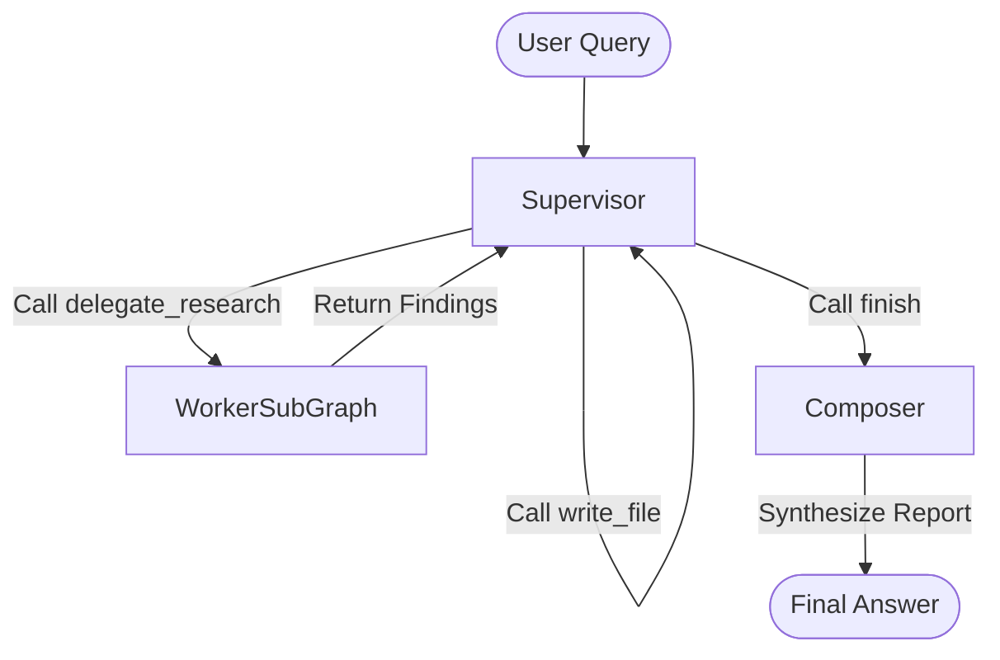

# Orchestrator Design Document (Dynamic Supervisor)

## 1. Overview
The Orchestrator is the central "Supervisor" of the deep research agent system. It uses a **Dynamic Supervisor** pattern (similar to ReAct or LangGraph Supervisor) to manage a living "Todo List" of research tasks. Unlike a static planner, it iteratively plans, delegates, and reacts to findings in a loop until the user's request is fully satisfied.

## 2. Architecture

The system follows a **Supervisor-Worker (Star Graph)** topology, implemented using `LangGraph`.

### 2.1 High-Level Flow


## 3. Core Components

### 3.1 Orchestrator State
The state tracks the conversation history and the structured "Todo List".

```python
class TaskStatus(str, Enum):
    PENDING = "pending"
    RUNNING = "running"
    COMPLETED = "completed"
    FAILED = "failed"

class ResearchTask(BaseModel):
    id: str = Field(default_factory=lambda: str(uuid.uuid4()))
    objective: str
    description: str
    status: TaskStatus = TaskStatus.PENDING
    result: Optional[str] = None # Summary of findings

class OrchestratorState(TypedDict):
    # The full conversation history (System + User + AI + ToolOutput)
    messages: List[BaseMessage]
    # The structured plan/state
    todos: List[ResearchTask]
    # Final output
    final_report: Optional[str]
```

### 3.2 Supervisor Node (The Dynamic Brain)
**Responsibility:** Iteratively manage the research process.
- **Input:** `messages`, `todos`
- **Process:** LLM Call (e.g., Gemini Pro) with access to **Supervisor Tools**.
- **Loop Logic**:
    1.  Review `messages` (which contain the User Query and previous Tool Outputs).
    2.  Review `todos` (current progress).
    3.  **Think**: What do I need to do next?
    4.  **Act**: Call one of the tools below.

### 3.3 Supervisor Tools

#### 1. `manage_todos(action, task_id, objective, status)`
- **Purpose**: Add, update, or remove tasks from the Todo list.
- **Use Case**: "I need to add a task to research OpenAI." / "Mark task X as completed."

#### 2. `delegate_research(task_id, objective, instructions)`
- **Purpose**: Spawn a **Worker Agent** to execute a specific research task.
- **Process**:
    -   Triggers the `WorkerSubGraph`.
    -   The Worker runs (search, read, summarize).
    -   Returns a `WorkerResult` (findings).
    -   The Supervisor receives this as a `ToolMessage`.

#### 3. `write_file(path, content)`
- **Purpose**: Persist intermediate findings or the research plan.
- **Use Case**: "Write the initial research plan to `plan.md`." / "Save these notes to `notes.md`."

#### 4. `finish(reason)`
- **Purpose**: Signal that research is sufficient.
- **Process**: Transitions the graph to the **Composer** node.

### 3.4 Worker Node (Sub-Graph)
- **Unchanged**: The Worker logic (Plan-Act-Observe loop for a single task) remains the same as defined in `worker_design.md`.
- **Integration**: The Supervisor calls the Worker as a "Tool".

### 3.5 Composer Node
**Responsibility:** Synthesize the final answer.
- **Input:** `final_report` request from Supervisor, plus all `todos` (which contain results).
- **Process**: LLM Call to write a cohesive markdown report.
- **Output**: `final_report`.

## 4. Prompts & Strategy

### 4.1 Supervisor System Prompt
> "You are a Research Supervisor. Your goal is to answer the user's request by coordinating a team of research workers.
>
> **Your Cycle:**
> 1.  **Analyze**: Look at the User Query and your current Todo List.
> 2.  **Plan**: Use `manage_todos` to update your plan. Remove finished tasks, add new ones based on recent findings.
> 3.  **Delegate**: Use `delegate_research` to assign PENDING tasks to workers.
> 4.  **Record**: Use `write_file` to keep notes.
> 5.  **Finish**: When you have enough info, call `finish`."

## 5. Comparison to Previous Design
- **Old**: Planner generated a full DAG once. If the investigations led down a rabbit hole, the plan was stale.
- **New**: Supervisor updates the plan *every step*. It can pivot, retry, or expand scope dynamically.
