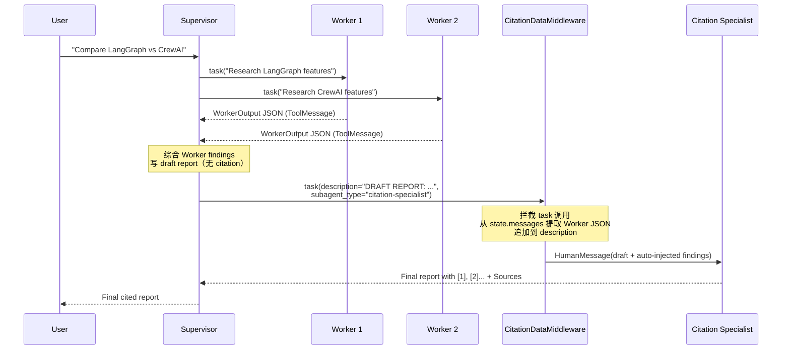
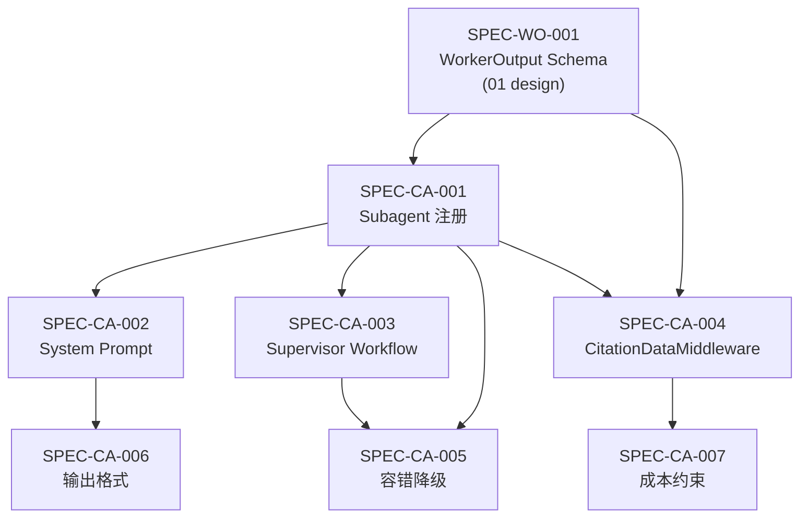

# Citation 标注设计 — CitationAgent as Subagent

> **状态**：设计阶段 | **父文档**：[citation_system_design.md](./citation_system_design.md) | **更新**：2026-05-03

---

## 一、架构决策：为什么 CitationAgent 是 Subagent 而非外部后处理

### 1.1 错误方案：外层编排

```python
# ❌ 错误：在 agent 系统外部做 citation
draft = await run_deep_research(query)
final = await citation_llm.ainvoke(f"Add citations to: {draft}")
```

**问题**：
- 违背系统自洽原则——Agent 系统应该自己产出完整、可信的报告
- 外层编排无法访问 Agent 内部 state（Worker findings、搜索历史等）
- 增加了系统的认知碎片——维护者需要理解两层编排逻辑

### 1.2 正确方案：作为 Subagent 集成

CitationAgent 通过 `create_deep_agent` 的 `subagents` 参数注册，与 research-worker 平级：

```python
subagents=[
    research_worker_spec,       # 研究型 worker
    citation_specialist_spec,   # citation 标注 worker
]
```

Supervisor 在所有研究 Worker 完成后，**始终**委派 citation-specialist：

```
Supervisor → task(research-worker, "研究 topic A") → findings A
Supervisor → task(research-worker, "研究 topic B") → findings B
Supervisor → 综合 findings，写 draft report（无 [N] 标注）
Supervisor → task(citation-specialist, draft report) → final report
```

> **注**：Supervisor 的 task description 中**只需包含 draft report**。
> Worker findings 由 `CitationDataMiddleware` 自动注入（见 §三）。

**优势**：
- 完全在 Agent 系统内部完成，无外部依赖
- 利用现有的 `task` tool 机制，零架构改动
- CitationDataMiddleware 确保 findings 零信息损失

### 1.3 Anthropic 的验证

> *"Subagent output to a filesystem to minimize the 'game of telephone.'
> Direct subagent outputs can bypass the main coordinator for certain types of results, improving both fidelity and performance."*

---

## 二、CitationAgent 的设计

### 2.1 Subagent 注册规格

```python
citation_specialist: dict[str, Any] = {
    "name": "citation-specialist",
    "description": (
        "Adds accurate inline citations [1], [2]... to a draft research "
        "report. Delegate to this agent AFTER all research is complete "
        "and you have written a draft report. Pass ONLY the draft report "
        "as the task description — worker findings are auto-injected."
    ),
    "system_prompt": DeepAgentPrompts.CITATION_SPECIALIST,
    "tools": [],       # 不需要搜索工具——纯文本处理
    "model": worker_model,  # 可以用轻量模型
    # NOTE: response_format 不设置——输出为自由格式 Markdown 报告。
    #       与 research-worker 的 response_format=WorkerOutput 不同，
    #       CitationAgent 输出是完整的 Markdown 报告，不适合结构化约束。
}
```

**关键点**：
- `tools=[]` — CitationAgent **不需要任何工具**，它只做文本处理
- `response_format` **不设置** — 输出为自由格式 Markdown 报告（与 research-worker 不同）
- Supervisor 的 task description **只需包含 draft report**（findings 由 middleware 注入）

### 2.2 CitationAgent System Prompt

```python
CITATION_SPECIALIST: str = """\
## Role
You are a Citation Specialist. Your ONLY job is to add accurate inline
citations to a draft research report based on the findings provided.

## Input
You will receive:
1. A **draft report** — a research report WITHOUT inline citations
2. **Worker findings** — structured JSON findings from research workers,
   each containing claim, source_urls (list), source_titles (list),
   and evidence

## Process
1. Read the draft report carefully, sentence by sentence.
2. For each factual claim in the report, find the matching finding
   from the worker outputs.
3. Assign a unique, sequential citation number [1], [2], [3]...
   to each distinct source URL.
4. Insert the citation number IMMEDIATELY after the factual claim
   it supports.
5. At the end of the report, add a "## Sources" section listing
   all cited sources with their numbers.

## Rules
- **One number per URL**: If multiple claims cite the same URL, they
  all use the same [N]. A single finding may have multiple source_urls;
  assign a separate [N] for each distinct URL.
- **Sequential numbering**: Numbers MUST be sequential (1, 2, 3...)
  with no gaps.
- **Every claim cited**: Every factual claim MUST have at least one
  citation. If no source matches, flag it with [citation needed].
- **Every source referenced**: Every entry in the Sources list MUST
  be referenced at least once in the report body.
- **No fabrication**: NEVER invent a source URL. Only use URLs from
  the worker findings.
- **Preserve content**: Do NOT modify the factual content of the
  draft report. Only ADD citation markers and the Sources section.
- **Language**: Output the report in the SAME language as the draft
  report. Do NOT translate content. The "## Sources" heading and
  citation markers [N] remain in English.
- **1:N handling**: When a single finding has multiple source_urls,
  assign a separate [N] for each distinct URL and place them together
  after the claim (e.g., [1][2]).
- **Source title**: In the Sources section, format each entry as:
  [N] Title — URL. Use source_titles from findings when available;
  if unavailable, use the URL's domain as title.

## Fallback
Worker findings are typically in JSON format with fields: claim,
source_urls, source_titles, and evidence. If findings are in plain
text instead of JSON, extract claim-source pairs as best you can
from the free text. Look for URLs mentioned near factual claims.

## Output
The complete report with inline citations [1], [2]... and a Sources
section at the end. Nothing else.
"""
```

### 2.3 Supervisor 如何委派

Supervisor prompt 需要增加 §6 Citation Workflow：

```python
# 添加到 SUPERVISOR prompt 的 §5 Report Quality Requirements 之后

## 6. Citation Workflow
When you have gathered sufficient research findings:
1. Write a comprehensive draft report based on all worker findings.
   Do NOT add inline citations [1], [2] yourself.
2. Delegate to `citation-specialist` with a task description containing
   ONLY your draft report. Worker findings are automatically provided
   to the citation-specialist — do NOT copy them manually.
3. Use the citation-specialist's output as your final response.

IMPORTANT: You MUST ALWAYS delegate to citation-specialist for the
final report. Do not attempt to add citations yourself.

## 6.1 Self-Citation Fallback
If the citation-specialist is unavailable or fails, you MUST add
citations yourself following these rules:
- Assign [1], [2], [3]... to each distinct source URL, sequentially.
- Place [N] IMMEDIATELY after the factual claim it supports.
- One number per distinct URL — reuse [N] for the same URL.
- At the end, add a "## Sources" section listing every cited URL
  with format: [N] Title — URL
- Every factual claim MUST have at least one citation.
- Every [N] in text MUST appear in Sources; every Sources entry
  MUST be referenced in text.
```

---

## 三、CitationDataMiddleware — Worker Findings 自动注入

### 3.1 问题背景

`deepagents` 的 `task` tool 通过 `description` 参数传递输入给 subagent（[subagents.py L405-411](file:///home/tianwei/workspace/deep_research_agent/.venv/lib/python3.12/site-packages/deepagents/middleware/subagents.py#L405)）。Subagent 的 messages 被完全替换为 `[HumanMessage(description)]`。

如果让 Supervisor 在 description 中手动拼接 draft report + Worker findings JSON，存在：
- **Token 爆炸**：Supervisor 单次输出需要包含所有 findings JSON
- **信息篡改**：LLM 在"复制" JSON 时可能改写内容
- **上下文压力**：Supervisor 上下文窗口中同时容纳所有内容

### 3.2 解决方案：CitationDataMiddleware

创建轻量 middleware，在 `wrap_tool_call` 中拦截 citation-specialist 的 task 调用，自动从 Supervisor state 的 messages 中提取 Worker findings 并追加到 description。

```python
class CitationDataMiddleware(AgentMiddleware):
    """Intercepts citation-specialist task calls to auto-inject Worker findings.

    Instead of relying on Supervisor to manually copy Worker JSON into
    the task description, this middleware extracts all WorkerOutput
    ToolMessages from the parent state and appends them to the
    CitationAgent's input.
    """

    def wrap_tool_call(self, request, handler):
        tool_call = request.tool_call
        if (tool_call.get("name") == "task"
                and tool_call.get("args", {}).get("subagent_type") == "citation-specialist"):
            worker_findings = self._extract_worker_findings(request.state)
            if worker_findings:
                original_desc = tool_call["args"]["description"]
                enriched_desc = (
                    f"{original_desc}\n\n"
                    f"## WORKER FINDINGS (auto-injected)\n\n"
                    f"{worker_findings}"
                )
                modified_call = {
                    **tool_call,
                    "args": {**tool_call["args"], "description": enriched_desc},
                }
                request = request.override(tool_call=modified_call)
        return handler(request)

    async def awrap_tool_call(self, request, handler):
        """Async version — same logic as sync."""
        tool_call = request.tool_call
        if (tool_call.get("name") == "task"
                and tool_call.get("args", {}).get("subagent_type") == "citation-specialist"):
            worker_findings = self._extract_worker_findings(request.state)
            if worker_findings:
                original_desc = tool_call["args"]["description"]
                enriched_desc = (
                    f"{original_desc}\n\n"
                    f"## WORKER FINDINGS (auto-injected)\n\n"
                    f"{worker_findings}"
                )
                modified_call = {
                    **tool_call,
                    "args": {**tool_call["args"], "description": enriched_desc},
                }
                request = request.override(tool_call=modified_call)
        return await handler(request)

    @staticmethod
    def _extract_worker_findings(state: dict) -> str:
        """Extract all WorkerOutput JSONs from ToolMessages in state."""
        from langchain_core.messages import ToolMessage
        findings_parts: list[str] = []
        for msg in state.get("messages", []):
            if isinstance(msg, ToolMessage):
                content = msg.content
                # Heuristic: WorkerOutput JSON contains "findings" key
                if isinstance(content, str) and '"findings"' in content:
                    try:
                        WorkerOutput.model_validate_json(content)
                        findings_parts.append(content)
                    except Exception:
                        pass  # Not a WorkerOutput, skip
        return "\n---\n".join(findings_parts)
```

### 3.3 Middleware 注册

```python
# 在 build_deep_agent() 中
from deep_research_agent.middleware.citation_data import CitationDataMiddleware

return create_deep_agent(
    model=main_model,
    tools=[search_tool],
    system_prompt=DeepAgentPrompts.SUPERVISOR,
    subagents=[research_subagent, citation_specialist],
    middleware=[CitationDataMiddleware()],  # ← 注入 Worker findings
    checkpointer=checkpointer,
    **overrides,
)
```

### 3.4 上下文压力分析

> **State 扩展不会增加 LLM 上下文压力。**

| 组件 | 上下文影响 | 说明 |
|------|-----------|------|
| Supervisor LLM | ✅ **减少** | 不需要在 tool call 中输出 findings JSON |
| CitationAgent LLM | ⬜ **不变** | 总是需要看到 findings（来源从"Supervisor 复制"变为"Middleware 注入"） |
| Graph State | ⬜ **不变** | 不修改 `AgentState` schema，不增加新 state 字段 |

---

## 四、数据流设计

### 4.1 完整流程



### 4.2 CitationAgent 的输出

```markdown
LangGraph 支持 MemorySaver 和 PostgresSaver 两种 checkpointer 后端 [1]，
其中 PostgresSaver 适用于生产环境... 与此不同，CrewAI 采用 YAML 配置
的方式定义 agent 协作关系 [2]...

## Sources
[1] LangGraph Checkpointing — https://langchain.com/docs/checkpointing
[2] CrewAI Core Concepts — https://docs.crewai.com/core-concepts/agents
```

---

## 五、容错设计

### 5.1 场景矩阵

| 场景 | 触发条件 | 处理策略 | 最终输出 |
|------|---------|---------|---------|
| 正常路径 | CitationAgent 成功返回 | 使用 CitationAgent 输出 | 精确 citation 报告 |
| 输出质量不佳 | 编号断裂/孤儿（由 03_validation 检测） | Phase 1: 接受并输出 | 有 citation 的报告 |
| Worker 纯文本降级 | `structured_response=None` | CitationAgent LLM 从纯文本提取 claim-source pairs | 尽力标注 |
| CitationAgent 执行失败 | Timeout / API error / safety filter | Supervisor §6.1 自行标注 | Supervisor 标注报告 |
| CitationAgent 返回空 | LLM 返回空字符串 | Supervisor 使用 draft（无 citation） | 无 citation 报告 |

### 5.2 L1 自检职责

CitationAgent **不做** L1 结构性验证（编号连续性等）。此职责由 [03_citation_validation_design.md](./03_citation_validation_design.md) 负责。CitationAgent 专注于单一认知任务：精确标注。

---

## 六、成本评估

| 组件 | 额外 LLM 调用 | 额外 Tokens | 说明 |
|------|-------------|-------------|------|
| CitationAgent | 1 次 | 输入 ~4000-10000, 输出 ~2000-6000 | 输入: system prompt + draft report + findings JSON; 输出: cited report |
| Supervisor 变更 | 0 次 | ~300 | prompt 增加 §6 Citation Workflow |
| CitationDataMiddleware | 0 次 | 0 | 纯代码逻辑，无 LLM 调用 |

**总额外成本**：约 1 次轻量 LLM 调用（~$0.002-0.01），每次研究必触发。对比总研究成本（通常 $0.05-0.50），增幅约 2-10%。

---

## 七、Spec 定义

### SPEC-CA-001: CitationAgent Subagent 注册

| 约束 | 要求 |
|------|------|
| `name` | `"citation-specialist"` |
| `tools` | `[]` — 空列表 |
| `response_format` | 不设置 |
| `model` | 可使用轻量模型 |

**验收标准**：

| ID | 条件 | 验证方法 |
|----|------|---------|
| AC-001-1 | `citation-specialist` 在 subagents 列表中 | 代码审查 |
| AC-001-2 | `tools=[]`，无 `response_format` | 代码审查 |
| AC-001-3 | Supervisor 可通过 `task(subagent_type="citation-specialist")` 调用 | 集成测试 |

### SPEC-CA-002: CitationAgent System Prompt

Prompt 必须包含以下 13 个语义区域：

| # | 区域 | 要求 |
|---|------|------|
| 1 | Role | 单一职责声明 |
| 2 | Input | draft report + Worker findings JSON |
| 3 | Process | 逐句扫描 → 匹配 → 编号 → 插入 → Sources |
| 4 | Dedup | 同一 URL 复用同一 [N] |
| 5 | Sequential | 从 1 开始连续递增 |
| 6 | Coverage | 每个 claim 至少一个 [N]；无匹配时 `[citation needed]` |
| 7 | Bidirectional | 正文 ↔ Sources 双向完整 |
| 8 | No fabrication | 禁止虚构 URL |
| 9 | Preserve content | 不修改 draft 事实内容 |
| 10 | Language | 输出语言与 draft 一致 |
| 11 | 1:N handling | 多 source_urls → 独立 [N] |
| 12 | Source title | `[N] Title — URL` 格式 |
| 13 | Fallback | 纯文本 findings 容错 |

**验收标准**：

| ID | 条件 | 验证方法 |
|----|------|---------|
| AC-002-1 | Prompt 包含 13 个语义区域 | Prompt 审查 |
| AC-002-2 | 中文 query → 中文输出 | 手动测试 |
| AC-002-3 | 同一 URL 跨 findings 复用编号 | 端到端测试 |
| AC-002-4 | Sources 格式为 `[N] Title — URL` | 输出审查 |

### SPEC-CA-003: Supervisor Citation Workflow

| 要求 | 说明 |
|------|------|
| 默认触发 | 所有研究场景都委派 citation-specialist |
| Draft-first | Supervisor 先写 draft（无 [N]），再委派 |
| Description | 只含 draft report（findings 由 middleware 注入） |
| 降级路径 | §6.1 Self-Citation Fallback 详细定义 |

**验收标准**：

| ID | 条件 | 验证方法 |
|----|------|---------|
| AC-003-1 | Supervisor prompt 包含 §6 + §6.1 | 代码审查 |
| AC-003-2 | 所有场景 Supervisor 都委派 citation-specialist | 端到端测试 |
| AC-003-3 | Supervisor 的 description 只含 draft report | Log 审查 |
| AC-003-4 | CitationAgent 失败时 Supervisor 自行标注 | 故障注入 |

### SPEC-CA-004: CitationDataMiddleware

| 约束 | 要求 |
|------|------|
| 触发条件 | 仅 `subagent_type == "citation-specialist"` |
| 数据来源 | state.messages 中的 WorkerOutput ToolMessages |
| 识别方式 | `WorkerOutput.model_validate_json()` 尝试解析 |
| 注入方式 | 追加到 description 末尾 |
| 不变性 | 不修改 Supervisor state |

**验收标准**：

| ID | 条件 | 验证方法 |
|----|------|---------|
| AC-004-1 | Middleware 注册到 `build_deep_agent()` | 代码审查 |
| AC-004-2 | CitationAgent 收到的 HumanMessage 包含 Worker JSON | Log 审查 |
| AC-004-3 | 非 citation-specialist 的 task 不受影响 | 集成测试 |
| AC-004-4 | Worker 纯文本降级时 graceful skip | Mock 测试 |

### SPEC-CA-005: 容错与降级

见 §5.1 场景矩阵。

| ID | 条件 | 验证方法 |
|----|------|---------|
| AC-005-1 | 纯文本 Worker 输出时仍可标注 | Mock 测试 |
| AC-005-2 | CitationAgent 失败时回退 Supervisor 自行标注 | 故障注入 |

### SPEC-CA-006: 输出格式

| 约束 | 规则 |
|------|------|
| 编号 | 从 1 开始连续递增，无间隔 |
| 去重 | 同一 URL 唯一编号 |
| 双向 | 正文 ↔ Sources 双向完整 |
| 保真 | 不修改 draft 事实内容 |
| 语言 | 与 draft 一致 |
| Sources | `[N] Title — URL` 格式 |
| L1 自检 | **不做**（03_validation 负责） |

| ID | 条件 | 验证方法 |
|----|------|---------|
| AC-006-1 | 编号连续递增 | L1 正则验证 |
| AC-006-2 | 无孤儿 [N] 或孤儿 Sources | L1 正则验证 |
| AC-006-3 | Sources 格式含 Title | 输出审查 |

### SPEC-CA-007: 成本约束

| 指标 | 目标值 |
|------|--------|
| 额外 LLM 调用 | ≤ 1 次 |
| 输入 Token | ~4000-10000 |
| 输出 Token | ~2000-6000 |
| 额外延迟 | ≤ 10s P95 |
| 成本增幅 | ≤ 10% of total |

---

## 八、实施清单

- [ ] 定义 `DeepAgentPrompts.CITATION_SPECIALIST` prompt
- [ ] 在 `build_deep_agent()` 中注册 `citation-specialist` subagent
- [ ] 实现 `CitationDataMiddleware` 并注册到 middleware 参数
- [ ] 修改 `DeepAgentPrompts.SUPERVISOR` 增加 §6 + §6.1
- [ ] 端到端测试：多 Worker 研究 → draft → middleware 注入 → citation-specialist → final report
- [ ] 故障注入测试：CitationAgent 失败时 Supervisor 自行标注
- [ ] 验证：CitationAgent 输出的 Sources 格式为 `[N] Title — URL`

---

## 九、Spec 依赖关系


