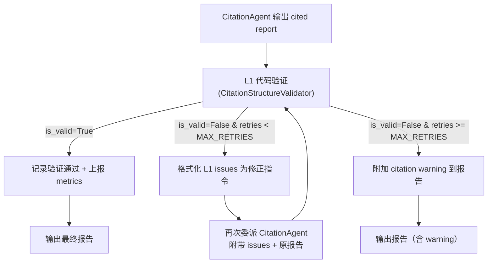

# Citation 验证设计 — L1 结构验证 + L2 语义归属

> **状态**：设计阶段 | **父文档**：[citation_system_design.md](./citation_system_design.md) | **更新**：2026-05-03

---

## 一、验证层次概览

| 层次 | 名称 | 验证内容 | 实现方式 | 阶段 |
|------|------|---------|---------|----|
| **L1** | 结构性验证 | `[N]` 编号 ↔ Sources 条目完整性 | 纯代码（正则） + 代码级 retry loop | Phase 1 |
| **L2** | 语义归属验证 | `[N]` 旁的 claim 是否真来自 Source N | CitationAgent 内建（prompt 级） | Phase 1 |
| **L3** | 内容真实性验证 | Source N 的网页是否包含 evidence 原文 | HTTP 抓取 + 文本匹配 | `OUT_OF_SCOPE` |

> **设计决策**：
> - L1：CitationAgent prompt 自检 + **代码级事后验证 + retry loop**（双重保障）
> - L2：内建于 CitationAgent 标注过程，当前阶段不做独立事后验证（后续可加 spot-check）
> - L3：当前阶段完全跳过，不实现任何代码

---

## 二、L1 结构性验证

### 2.1 验证规则

| 规则 ID | 检查项 | 严重度 | 说明 |
|---------|--------|--------|------|
| L1-01 | 编号断裂 | 🔴 Error | 正文引用了 `[N]`，但 Sources 中不存在 N |
| L1-02 | 孤儿 Source | 🟡 Warning | Sources 中有编号 N，但正文中从未引用 |
| L1-03 | 编号连续性 | 🟡 Warning | 编号不连续（如 1, 2, 5 跳过了 3, 4） |
| L1-04 | 重复 URL | 🟡 Warning | 同一 URL 被分配了多个不同编号 |
| L1-05 | 无 Sources 段 | 🔴 Error | 报告有 `[N]` 引用但缺少 Sources 段 |

### 2.2 数据模型

使用 Pydantic `BaseModel` 定义验证结果：

```python
from enum import Enum
from typing import Optional
from pydantic import BaseModel, Field


class Severity(str, Enum):
    """Validation issue severity level."""
    ERROR = "error"
    WARNING = "warning"


class ValidationIssue(BaseModel):
    """A single validation finding."""
    rule_id: str = Field(description="Rule identifier, e.g. 'L1-01'")
    severity: Severity
    message: str = Field(description="Human-readable description of the issue")
    context: Optional[str] = Field(
        default=None,
        description="Relevant text snippet from the report for debugging",
    )


class L1ValidationResult(BaseModel):
    """Result of L1 structural validation."""
    is_valid: bool = Field(description="True if no ERROR-level issues found")
    issues: list[ValidationIssue] = Field(default_factory=list)
    body_citations: set[int] = Field(default_factory=set)
    source_entries: dict[int, str] = Field(default_factory=dict)

    @property
    def error_count(self) -> int:
        return sum(1 for i in self.issues if i.severity == Severity.ERROR)

    @property
    def warning_count(self) -> int:
        return sum(1 for i in self.issues if i.severity == Severity.WARNING)
```

### 2.3 实现

封装为 `CitationStructureValidator` 类，解决以下 review 问题：
- **R-01**：正则提取前先剥离 code blocks / inline code，避免误匹配
- **R-02**：Sources 段 URL 提取增加子正则
- **R-03**：L1-05 触发时 fast-fail，跳过后续冗余检查
- **R-04**：standalone function → class 封装

```python
import logging
import re

from deep_research_agent.citation.models import (
    L1ValidationResult,
    Severity,
    ValidationIssue,
)


class CitationStructureValidator:
    """L1 structural validation for citation integrity.

    Validates that inline citation numbers [N] in a report body
    have matching entries in the Sources section, and vice versa.

    Design decisions:
    - Code blocks (fenced and inline) are stripped before extraction
      to avoid false positives from array indices or code examples.
    - Sources header is always English '## Sources' (enforced by
      CitationAgent prompt). Content language may vary.
    """

    # Fixed English header — CitationAgent prompt 强制输出此格式
    _SOURCES_HEADER_RE = re.compile(
        r"^##\s*Sources?\s*$", re.MULTILINE | re.IGNORECASE
    )
    _SOURCE_ENTRY_RE = re.compile(
        r"^\[(\d+)\]\s+(.+)$", re.MULTILINE
    )
    _CITATION_RE = re.compile(r"\[(\d+)\]")
    _FENCED_CODE_RE = re.compile(r"```[\s\S]*?```")
    _INLINE_CODE_RE = re.compile(r"`[^`]+`")

    def __init__(self) -> None:
        self.logger = logging.getLogger(__name__)

    def validate(self, report: str) -> L1ValidationResult:
        """Validate citation structure of a complete report.

        Args:
            report: Full report text containing body and Sources section.

        Returns:
            L1ValidationResult with all issues found.
        """
        issues: list[ValidationIssue] = []

        # --- Split body vs Sources section ---
        body, source_entries = self._split_report(report)

        # --- Strip code blocks before extracting citations ---
        clean_body = self._strip_code_blocks(body)
        body_citations = {
            int(m) for m in self._CITATION_RE.findall(clean_body)
        }

        if not body_citations:
            self.logger.debug("No inline citations found in report body")
            return L1ValidationResult(is_valid=True)

        # --- L1-05: fast-fail if citations exist but no Sources section ---
        if not source_entries:
            issues.append(ValidationIssue(
                rule_id="L1-05",
                severity=Severity.ERROR,
                message="Report has inline citations but no Sources section",
            ))
            self.logger.warning("L1-05: citations found but no Sources section")
            return L1ValidationResult(
                is_valid=False,
                issues=issues,
                body_citations=body_citations,
                source_entries=source_entries,
            )

        # --- L1-01: dangling citations ---
        orphan_citations = body_citations - set(source_entries.keys())
        for n in sorted(orphan_citations):
            issues.append(ValidationIssue(
                rule_id="L1-01",
                severity=Severity.ERROR,
                message=f"Citation [{n}] in body has no entry in Sources",
            ))

        # --- L1-02: orphan sources ---
        orphan_sources = set(source_entries.keys()) - body_citations
        for n in sorted(orphan_sources):
            issues.append(ValidationIssue(
                rule_id="L1-02",
                severity=Severity.WARNING,
                message=f"Source [{n}] exists but is never cited in body",
            ))

        # --- L1-03: non-sequential numbering ---
        if source_entries:
            expected = set(range(1, max(source_entries.keys()) + 1))
            gaps = expected - set(source_entries.keys())
            if gaps:
                issues.append(ValidationIssue(
                    rule_id="L1-03",
                    severity=Severity.WARNING,
                    message=f"Non-sequential numbering, missing: {sorted(gaps)}",
                ))

        # --- L1-04: duplicate URLs ---
        url_to_numbers: dict[str, list[int]] = {}
        for num, url in source_entries.items():
            url_to_numbers.setdefault(url, []).append(num)
        for url, numbers in url_to_numbers.items():
            if len(numbers) > 1:
                issues.append(ValidationIssue(
                    rule_id="L1-04",
                    severity=Severity.WARNING,
                    message=f"URL {url} assigned multiple numbers: {numbers}",
                ))

        has_errors = any(i.severity == Severity.ERROR for i in issues)
        if issues:
            self.logger.info(
                "L1 validation complete: %d errors, %d warnings",
                sum(1 for i in issues if i.severity == Severity.ERROR),
                sum(1 for i in issues if i.severity == Severity.WARNING),
            )

        return L1ValidationResult(
            is_valid=not has_errors,
            issues=issues,
            body_citations=body_citations,
            source_entries=source_entries,
        )

    def _split_report(self, report: str) -> tuple[str, dict[int, str]]:
        """Split report into body text and parsed source entries."""
        sources_match = self._SOURCES_HEADER_RE.search(report)
        if not sources_match:
            return report, {}

        body = report[:sources_match.start()]
        sources_text = report[sources_match.start():]
        source_entries = {
            int(m.group(1)): self._extract_url(m.group(2).strip())
            for m in self._SOURCE_ENTRY_RE.finditer(sources_text)
        }
        return body, source_entries

    @staticmethod
    def _extract_url(text: str) -> str:
        """Extract URL from a Sources entry line.

        Handles formats:
        - 'https://example.com'
        - 'Title - https://example.com'
        - '[Title](https://example.com)'
        """
        # Markdown link format
        md_match = re.search(r"\((https?://[^\s)]+)\)", text)
        if md_match:
            return md_match.group(1)
        # URL anywhere in text
        url_match = re.search(r"(https?://[^\s]+)", text)
        if url_match:
            return url_match.group(1)
        return text

    @staticmethod
    def _strip_code_blocks(text: str) -> str:
        """Remove fenced code blocks and inline code to avoid false matches."""
        text = CitationStructureValidator._FENCED_CODE_RE.sub("", text)
        text = CitationStructureValidator._INLINE_CODE_RE.sub("", text)
        return text
```

### 2.4 集成位置：双重验证 + 代码级 Retry Loop

L1 验证采用**双重保障**架构：

1. **第一层：CitationAgent prompt 自检**——减少问题发生概率
2. **第二层：代码级事后验证 + retry loop**——兜底保障

```
CitationAgent prompt 中嵌入自检指令:
"Before outputting the final report, verify:
 - Every [N] in the body has a matching entry in Sources
 - Every entry in Sources is cited at least once
 - Numbers are sequential (1, 2, 3...) with no gaps
 If any check fails, fix the issue before outputting."
```

#### Self-Correction Loop（Phase 1 实现）



**关键参数**：
- `MAX_RETRIES = 1` — 最多重试 1 次，防止无限循环和 token 浪费
- Retry 时仅传递 L1 ERROR 级别的 issues 给 CitationAgent，WARNING 不触发 retry

**Retry 委派格式**：

```markdown
## CITATION CORRECTION REQUIRED

The following citation issues were found in your output:

- L1-01: Citation [8] in body has no entry in Sources
- L1-01: Citation [9] in body has no entry in Sources

Please fix these issues and output the corrected report.

## ORIGINAL REPORT (with issues)

{CitationAgent 上次输出的报告}
```

**Retry 耗尽后的 Warning 格式**：

报告末尾 Sources 段之后附加：

```markdown
> ⚠️ **Citation Notice**: Some citation inconsistencies were detected
> but could not be automatically resolved. Citations [8], [9] may not
> have matching source entries.
```

---

## 三、L2 语义归属验证

### 3.1 问题定义

L1 只检查**编号映射是否完整**，L2 检查**编号是否标注在正确的位置**：

```
Report: "LangGraph 支持 100 万 token 上下文 [3]"
Source [3]: https://openai.com/gpt-4-1/   ← 这是 GPT-4.1 的页面，不是 LangGraph！

L1: ✅ (编号 [3] 存在于 Sources 列表)
L2: ❌ (claim 内容与 source [3] 不匹配)
```

### 3.2 当前阶段策略：CitationAgent 内建

L2 验证**内建于 CitationAgent 的标注过程**中——CitationAgent 逐句扫描 report，在 worker findings 中查找匹配的 claim-source 对，然后标注 `[N]`。只要 CitationAgent 严格遵守"只使用 worker findings 中的 source URL"，L2 就自然融入标注流程。

> **明确声明**：当前阶段 L2 **没有独立的事后验证步骤**。我们信任 CitationAgent 的 prompt following 质量。后续可引入 L2-lite 抽样 spot-check 机制（如 embedding 相似度 + 阈值判断）作为增强。

**Prompt 级强化**：

```
CRITICAL: When assigning citation [N] to a sentence in the report:
1. Find the worker finding whose CLAIM most closely matches the sentence
2. Use that finding's SOURCE URL as the cited source
3. NEVER assign a citation based on topic similarity alone — the claim
   must specifically match

If a sentence in the report does not match ANY worker finding's claim,
mark it as [citation needed] rather than guessing.
```

### 3.3 准确度预期

| 方式 | 相对准确度 | 成本 |
|------|----------|------|
| Supervisor 自行标注（现状） | 基线 | 0 |
| CitationAgent 基于 findings 标注 | 显著优于基线 | 1 次 LLM 调用 |
| CitationAgent + embedding 匹配 | 最优 | 1 次 LLM + embedding |
| CitationAgent + L2-lite spot-check | 最优 + 可度量 | 1 次 LLM + embedding 抽样 |

当前阶段推荐 CitationAgent 基于 findings 标注即可。准确度的具体数值需通过 benchmark 实测获得。

### 3.4 未来增强：L2-lite 抽样 Spot-Check

> **阶段**：Phase 2+（当前不实现）

从最终报告中随机抽取 3-5 个 citations，用 embedding 相似度验证 claim-source 匹配度。纯代码实现，不需要额外 LLM 调用。

---

## 四、L3 内容真实性验证

> **阶段**：`OUT_OF_SCOPE` — 当前阶段完全跳过，不实现任何代码。

### 4.1 架构描述（仅作 Roadmap 参考）

L3 验证 Worker 的 evidence 是否**真的存在于源网页中**：

```
Worker evidence: "PostgresSaver uses asyncpg with pool size of 10"
Source URL: https://github.com/langchain-ai/langgraph/blob/main/...

L3: 抓取 URL 内容 → 全文搜索 evidence 片段 → 匹配到? ✅ 真实
```

### 4.2 不实现的原因

| 限制 | 说明 |
|------|------|
| 网络延迟 | 每个 URL 需要 HTTP 请求，10 个 sources = 数秒额外延迟 |
| 内容变更 | 网页内容可能已更新，搜索时的内容与验证时不同 |
| 付费墙 | 部分 source 无法公开访问 |
| 成本 | 如果用 URL Reader 工具，每次验证需要额外工具调用 |
| 收益比 | L1 + L2 已经覆盖绝大多数 citation 问题 |

L3 留作长期增强方向，待 Source Retention (04) 的 filesystem 存储方案成熟后再评估。

---

## 五、验证失败时的处理策略

### 5.1 策略矩阵

| 验证层 | 失败类型 | 处理策略 | 原因 |
|--------|---------|---------|------|
| L1 Error | 编号断裂 | 代码级 retry loop（MAX_RETRIES=1） | 可自动修复的结构问题 |
| L1 Warning | 孤儿 Source / 编号不连续 | Log warning，不阻塞，不触发 retry | 不影响报告质量 |
| L2 Fail | 张冠李戴 | 标记 `[citation needed]`（CitationAgent 内建） | 宁缺勿错 |

### 5.2 Retry 触发条件

仅 **L1 ERROR** 触发 retry：
- `L1-01`（编号断裂）
- `L1-05`（无 Sources 段）

**L1 WARNING** 不触发 retry，仅记录日志。

### 5.3 Retry 耗尽后的降级策略

当 retry 次数达到 `MAX_RETRIES` 且仍有 L1 ERROR 时：
1. 在报告末尾附加结构化 warning（见 §2.4 格式）
2. 将验证结果写入 structured log
3. 原样输出报告（有 citation 总比没有好）

---

## 六、Observability & 上报

### 6.1 结构化日志

所有验证事件通过 `logging` 输出，按以下格式记录：

```python
# L1 验证通过
self.logger.info(
    "L1 validation passed",
    extra={
        "citation_count": len(body_citations),
        "source_count": len(source_entries),
    },
)

# L1 验证失败
self.logger.warning(
    "L1 validation failed: %d errors, %d warnings",
    result.error_count,
    result.warning_count,
    extra={
        "issues": [issue.model_dump() for issue in result.issues],
        "retry_attempt": retry_count,
    },
)
```

### 6.2 上报机制

| 上报渠道 | 数据 | 用途 |
|---------|------|------|
| LangSmith trace metadata | `L1ValidationResult.model_dump()` | 单次研究的 citation 质量追溯 |
| Streaming event | `{"type": "citation_validation", "is_valid": bool, "issues": [...]}` | 调用方实时感知 |
| Structured log | 完整 `L1ValidationResult` | 后续 benchmark 分析和质量趋势监控 |

### 6.3 Metrics 定义

| Metric | 计算方式 | 用途 |
|--------|---------|------|
| `citation_l1_pass_rate` | L1 验证通过次数 / 总验证次数 | 整体 citation 质量趋势 |
| `citation_l1_retry_rate` | 触发 retry 次数 / 总验证次数 | CitationAgent prompt 质量评估 |
| `citation_l1_retry_success_rate` | retry 后通过次数 / retry 次数 | retry 机制有效性 |

---

## 七、与其他组件的交互

| 组件 | 验证层 | 交互方式 |
|------|--------|---------|
| Worker output (01) | L2 依赖 | 使用 Worker 的 JSON findings（`Finding.claim` + `Finding.source_urls` + `Finding.evidence`）做语义匹配 |
| CitationAgent (02) | L1 + L2 内建 | CitationAgent 的标注过程内建 L2；L1 作为 prompt 自检 + 代码事后验证 |
| Source Retention (04) | L3 依赖（未来） | 需要保留的 source content 来做内容真实性验证 |
| Supervisor | L1 retry loop | Supervisor 收到 CitationAgent 输出后执行代码级 L1 验证，决定是否 retry |

---

## 八、Spec 定义

### SPEC-VAL-001: CitationStructureValidator (L1)

**模块**：`deep_research_agent.citation.validators.structure_validator`

#### 验证规则 Spec

| Rule ID | Check | Severity | Input | Expected |
|---------|-------|----------|-------|----------|
| L1-01 | Dangling citation | ERROR | Body has `[N]`, Sources lacks N | Issue `L1-01` |
| L1-02 | Orphan source | WARNING | Sources has N, body never cites `[N]` | Issue `L1-02` |
| L1-03 | Non-sequential | WARNING | Source entries skip numbers | Issue with missing list |
| L1-04 | Duplicate URL | WARNING | Same URL, multiple numbers | Issue with dup list |
| L1-05 | Missing Sources | ERROR | Body has `[N]` but no `## Sources` | Fast-fail `L1-05` |

#### 验收标准

| ID | Criterion | Verification |
|----|-----------|-------------|
| AC-L1-01 | 检测 body 引用 `[5]` 但 Sources 只有 `[1]-[4]` 时返回 ERROR | Unit test |
| AC-L1-02 | Sources 有 `[3]` 但 body 未引用时返回 WARNING | Unit test |
| AC-L1-03 | Sources `{1, 2, 5}` 时报告缺失 `{3, 4}` | Unit test |
| AC-L1-04 | 两个编号指向同一 URL 时返回 WARNING | Unit test |
| AC-L1-05 | 有引用但无 `## Sources` 时 ERROR + fast-fail | Unit test |
| AC-L1-06 | Code block 中的 `[1]` 不被误识别为 citation | Unit test |
| AC-L1-07 | Inline code 中的 `[0]` 不被误识别 | Unit test |
| AC-L1-08 | 空报告返回 `is_valid=True` | Unit test |
| AC-L1-09 | 完全正确的报告返回 `is_valid=True, issues=[]` | Unit test |
| AC-L1-10 | 使用 `logging` 而非 `print` | Code review |
| AC-L1-11 | Pydantic BaseModel 定义所有数据模型 | Code review |

### SPEC-VAL-002: Self-Correction Retry Loop

**模块**：集成在 Supervisor 的 citation workflow 中

#### 行为 Spec

| Parameter | Value | Rationale |
|-----------|-------|-----------|
| `MAX_RETRIES` | 1 | 防止无限循环和 token 浪费 |
| Retry 触发条件 | `L1ValidationResult.is_valid == False` | 仅 ERROR 级别 |
| Retry 输入 | L1 issues + 原报告 | 给 CitationAgent 明确的修正指令 |
| 耗尽后行为 | 附加 warning + 原样输出 | 有 citation 总比没有好 |

#### 验收标准

| ID | Criterion | Verification |
|----|-----------|-------------|
| AC-RC-01 | L1 ERROR 时触发 retry | Integration test |
| AC-RC-02 | L1 WARNING 不触发 retry | Integration test |
| AC-RC-03 | Retry 成功后输出修正报告 | Integration test |
| AC-RC-04 | MAX_RETRIES 耗尽后附加 warning 并输出 | Integration test |
| AC-RC-05 | Retry 次数和结果记录到 structured log | Code review |

### SPEC-VAL-003: L2 语义归属（CitationAgent 内建）

#### Prompt-Level Spec

| Rule ID | Prompt Requirement | Verification |
|---------|-------------------|-------------|
| L2-P01 | "Find the finding whose CLAIM most closely matches" | Prompt review |
| L2-P02 | "Use that finding's SOURCE URL" | Prompt review |
| L2-P03 | "NEVER assign based on topic similarity alone" | Prompt review |
| L2-P04 | "If no match, mark as [citation needed]" | E2E test |

#### 验收标准

| ID | Criterion | Verification |
|----|-----------|-------------|
| AC-L2-01 | CitationAgent prompt 包含 L2-P01~P04 | Prompt review |
| AC-L2-02 | 不匹配的 claim 被标记为 `[citation needed]` | E2E test |
| AC-L2-03 | Worker A 的 URL 不会错误标注到 Worker B 的 claim | E2E test |

### SPEC-VAL-004: Observability

#### 验收标准

| ID | Criterion | Verification |
|----|-----------|-------------|
| AC-OBS-01 | L1 验证结果通过 streaming event 上报 | Integration test |
| AC-OBS-02 | L1 结果写入 structured log（含 issues 详情） | Log review |
| AC-OBS-03 | L1 结果附加到 LangSmith trace metadata | Trace review |
| AC-OBS-04 | 可计算 `citation_l1_pass_rate` metric | Dashboard |
