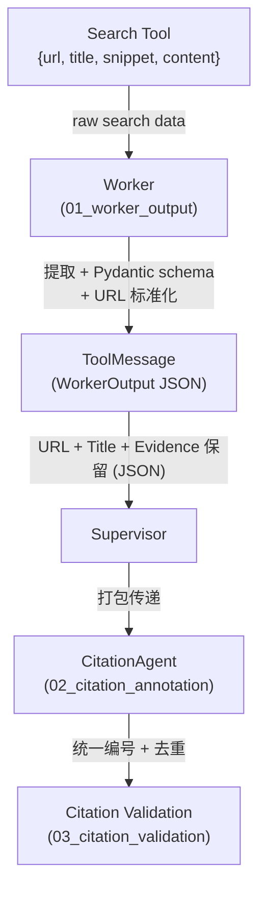
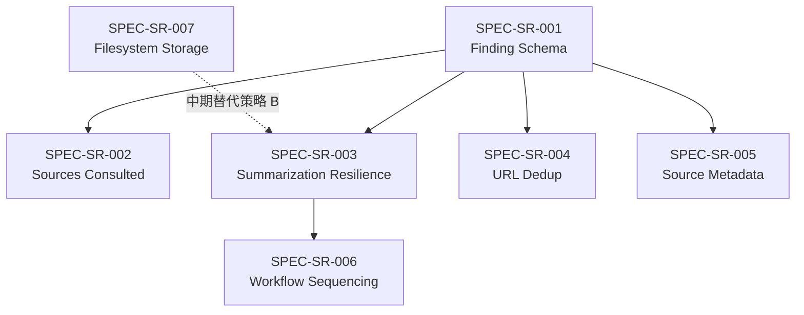

# Source 保留设计 — Provenance Preservation Pipeline

> **状态**：设计阶段 | **父文档**：[citation_system_design.md](./citation_system_design.md) | **更新**：2026-05-03

---

## 一、问题定义

### 1.1 改进后的 Source 保留链路

> **对比**：旧版链路中 Worker 输出纯文本叙述，fact-to-source 映射在 ToolMessage 阶段完全丢失。改进后通过 Pydantic structured output 在 schema 级别保留 provenance。

**旧版（纯文本叙述）**：

```
Search Tool → {url, title, snippet, content}     ← 100% source 数据
     ↓
Worker LLM context window                         ← Worker 能看到全部
     ↓
Worker 自由文本叙述                                ← 纯 string，URL 可能遗漏
     ↓
ToolMessage(content=plain_text)                    ← fact-source 映射丢失
     ↓
Supervisor context window                          ← 二手信息，无法溯源
```

**新版（Pydantic structured output）**：

```
Search Tool → {url, title, snippet, content}     ← 100% source 数据
     ↓
Worker LLM context window                         ← Worker 能看到全部
     ↓
Worker structured_response (WorkerOutput)          ← Pydantic schema 保证结构
     ↓
ToolMessage(content=json_string)                   ← JSON 序列化，保留 URL + Evidence
     ↓
Supervisor context window                          ← 能看到结构化 JSON
```

**核心改进**：通过 Pydantic `response_format=WorkerOutput`，Worker 输出从纯文本变为结构化 JSON。每个 Finding 的 `source_urls`、`source_titles` 和 `evidence` 字段在 schema 级别被强制保留。

### 1.2 需要保留什么

| 数据 | 保留必要性 | 原因 |
|------|-----------|------|
| Source URL | 🔴 必须 | citation 标注的基础 |
| Page Title | 🟡 推荐 | Sources 列表的可读性（由 `Finding.source_titles` 承载） |
| Evidence Quote | 🔴 必须 | L2 语义归属验证的依据 |
| Raw Content | 🟢 可选 | L3 真实性验证（成本高） |
| Snippet | 🟡 推荐 | 介于 evidence 和 raw content 之间的折中 |

---

## 二、保留策略设计

### 2.1 核心原则

> **在 Worker 的 structured output 中保留，而非在系统层面额外存储。**

原因：
1. `create_deep_agent` 的 subagent 机制通过 `ToolMessage(content=str)` 传递结果——这是我们**唯一的数据通道**
2. 不修改 `deepagents` 库 = 不能在 state 中增加额外字段
3. Worker 的 `response_format=WorkerOutput` 确保 JSON 输出中必含 `source_urls`、`source_titles` 和 `evidence`——由 Pydantic schema 在框架级别强制

### 2.2 三层保留策略

| 层 | 保留内容 | 载体 | Token 成本 |
|----|---------|------|-----------|
| **必须** | URL + Title + Evidence Quote（per finding） | Pydantic `Finding` schema 中的 `source_urls`、`source_titles` 和 `evidence` 字段 | 包含在 Worker JSON 输出中 |
| **推荐** | Sources Consulted 完整列表 | `WorkerOutput.sources_consulted` 字段 | ~100-200 tokens |
| **中期** | Raw search result content | Filesystem 存储（Anthropic 模式） | 需要额外工具 |

### 2.3 "必须"层：Pydantic Finding Schema（已在 01_worker_output_design 中设计）

每个 Finding 包含：
```json
{
  "claim": "事实性声明",
  "source_urls": ["https://example.com/article"],
  "source_titles": ["Article Title"],
  "evidence": "从 source 中提取的关键原文"
}
```

这确保了每个事实性声明的 URL、Title 和 evidence 在 Worker 输出中被保留，通过 Pydantic schema 的 `min_length=1` 约束在框架级别强制执行。URL 在 Worker 输出时由 `urls_must_be_valid_and_normalized` validator 完成标准化（详见 [01_worker_output_design.md §2.2](./01_worker_output_design.md)）。通过 ToolMessage 传递给 Supervisor 和 CitationAgent。

### 2.4 "推荐"层：Sources Consulted

Worker 输出末尾列出所有搜索过的 URL（包括未产出 finding 的）：

```markdown
### Sources Consulted
- https://langchain.com/docs/checkpointing — LangGraph checkpointing docs
- https://blog.langchain.com/langgraph-v0.2 — Release announcement
- https://stackoverflow.com/q/78901234 — Community Q&A (not directly useful)
```

**价值**：
- Supervisor 可以判断搜索覆盖度是否充分
- 审计时可以追溯 Worker 的搜索路径
- 避免 Supervisor 委派重复搜索

### 2.5 "中期"层：Filesystem 存储（Anthropic 模式）

Anthropic 的博客明确提到：

> *"Subagent output to a filesystem to minimize the 'game of telephone.'*
> *Subagents call tools to store their work in external systems, then pass lightweight references back to the coordinator."*

在 `create_deep_agent` 中，Worker 有 `write_file` 等 filesystem 工具。Worker 可以将详细的搜索结果写入文件，然后在 ToolMessage 中只返回文件引用：

```markdown
### Detailed Search Results
Full search results have been saved to:
/research/worker_1_search_results.md

### Findings (summary)
**Finding 1**: ...
```

**系统价值（不仅限于 L3 验证）**：

| 价值维度 | 说明 |
|---------|------|
| **高并发支持** | 减少 context window 中的 token 占用——ToolMessage 只传 findings JSON + file reference，而非 raw content。在多用户并发场景下降低 LLM API 的 token 吞吐压力 |
| **高可用** | 搜索结果持久化到 filesystem 后，即使 Agent session 中断或 LLM context 被截断，原始数据仍可恢复 |
| **L3 验证依赖** | 回溯原始 URL 验证 evidence 真实性时，可直接从 filesystem 读取搜索时快照的内容，避免重新 HTTP 请求（网页可能已变更） |
| **审计与导出** | 完整的搜索结果存档支持事后审计、报告导出、合规追溯 |

**实施前提**：

1. 需要确认 `create_deep_agent` 的 `StateBackend`（默认后端）下的 filesystem 是否支持持久化。如果是虚拟 filesystem（不持久），需评估替代方案（外部对象存储、临时文件系统挂载等）
2. 需要为 Supervisor 或 CitationAgent 配置 `read_file` 工具
3. 需要定义文件生命周期管理：研究完成后的清理策略

**规划**：作为中期增强方向，在 Finding 三元组方案稳定运行后推进。优先级高于 L3 验证——filesystem 存储是 L3 验证的基础设施前提。

---

## 三、Summarization 对 Source 保留的影响

### 3.1 风险分析

`SummarizationMiddleware` 在 Supervisor 的上下文窗口达到 85% 时会压缩旧消息。如果 Worker 返回的带 Source 的 ToolMessage 被 summarized，Source 信息可能丢失。

### 3.2 实际风险评估

| 场景 | 风险 | 原因 |
|------|------|------|
| 2-3 个 Worker 的简单研究 | 🟢 低 | 总消息量不太可能触发 summarization |
| 5+ Worker 的深度研究 | 🟡 中 | 早期 Worker 的 ToolMessage 可能被 summarized |
| 多轮对话中的追加研究 | 🔴 高 | 前几轮的 Worker 结果几乎必然被 summarized |

### 3.3 缓解策略

**策略 A：调整 Supervisor 工作流顺序**（推荐）

确保 Supervisor 在**委派 CitationAgent 之前**不会触发 summarization——即在同一个"研究周期"内完成所有 Worker 委派 → draft 写作 → CitationAgent 委派。

这是自然的工作流顺序，不需要代码改动。只要 Supervisor 在收到所有 Worker 结果后立即写 draft 并委派 CitationAgent，Worker 的 ToolMessage 还在 context window 中。

**策略 B：CitationAgent 在一次 task 调用中接收所有必要数据**

Supervisor 将 draft report 和所有 Worker findings 作为**单个 task description** 传给 CitationAgent。这样即使 Worker 的 ToolMessage 后来被 summarized，CitationAgent 已经在自己的隔离 context 中拥有了完整数据。

```
Supervisor → task(citation-specialist, """
  DRAFT REPORT: {完整 draft}
  WORKER FINDINGS: {所有 Worker 的 Finding 三元组}
""")
```

**这是最关键的缓解措施**——CitationAgent 作为 subagent 有自己独立的 context window，不受 Supervisor 的 summarization 影响。

> [!WARNING]
> **可靠性风险**：策略 B 依赖 Supervisor LLM 在 task description 中**忠实传递** Worker findings。存在以下风险：
> 1. Supervisor 可能改写或省略部分 Worker findings（LLM 不擅长逐字复制长文本）
> 2. 多 Worker 大量 findings（如 5 Workers × 10 findings = 50 个 JSON 对象）拼接后可能超出 task description 的有效认知长度
> 3. 无程序化保证——完全依赖 prompt 指令
>
> **缓解**：
> - Supervisor prompt 中明确要求**逐字复制 ToolMessage.content**（而非重新格式化），并给出示例
> - 生产环境增加 **monitoring 指标**：比较 CitationAgent 输入中的 distinct source URL 数量与所有 Worker 输出中的总 distinct source URL 数量，当比值 < 80% 时发出告警

**策略 C：将 Source 数据存到 filesystem**（中期）

利用 Anthropic 模式，Worker 将搜索结果写入文件，CitationAgent 从文件读取。这从根本上绕过了 message history 的 summarization 问题——数据不在 context window 中传递，而是通过 filesystem 的引用传递。这是策略 B 可靠性风险的终极解决方案。

### 3.4 决策

采用策略 A + B 组合（当前阶段），中期过渡到 A + C：

1. **当前**：Supervisor 的 citation workflow 自然保证了时序（Worker → draft → CitationAgent 在一个研究周期内完成）+ Supervisor 将所有数据打包传给 CitationAgent 的 task description
2. **中期**：Worker 将搜索结果写入 filesystem，CitationAgent 从 filesystem 读取，彻底消除策略 B 的 LLM 复制可靠性风险

---

## 四、Source 去重

### 4.1 问题

多个 Worker 可能搜索到相同的 Source URL。在最终报告中，同一 URL 应该只有一个编号。

### 4.2 URL 标准化

`Finding` schema 的 `urls_must_be_valid_and_normalized` validator 在 Worker 输出时已完成 URL 标准化（详见 [01_worker_output_design.md §2.2](./01_worker_output_design.md)）：

| 标准化规则 | 示例 |
|-----------|------|
| Lowercase scheme + hostname | `HTTPS://A.com/path` → `https://a.com/path` |
| Strip trailing slash（非根路径） | `https://a.com/path/` → `https://a.com/path` |
| Remove default ports | `https://a.com:443/path` → `https://a.com/path` |
| Remove empty fragment | `https://a.com/path#` → `https://a.com/path` |

标准化后，CitationAgent 和 L1-04 验证可直接做**字符串精确比较**去重，无需重复标准化。

> **注**：当前标准化**未移除 query params**（如 `?utm_source=...`）。这是有意的保守决策——tracking params 与正常 query string 难以可靠区分（如 `?page=2` 是有意义的参数）。如果未来需要移除 tracking params，可通过维护 known tracking param 黑名单实现。

### 4.3 去重位置

| 位置 | 可行性 | 原因 |
|------|--------|------|
| Worker 内部 | ❌ 不可行 | Worker 之间相互隔离，不知道其他 Worker 搜了什么 |
| Supervisor | 🟡 可行但不理想 | Supervisor 能看到所有 Worker 输出，但去重增加认知负担 |
| CitationAgent | ✅ 最佳 | CitationAgent 的核心职责就是统一分配编号 |

**决策**：去重在 CitationAgent 中完成。CitationAgent 的 prompt 中已有规则：

```
One number per URL: If multiple claims cite the same URL, they all
use the same [N].
```

---

## 五、Source 元数据标准

### 5.1 最小 Source 元数据

```
URL: https://example.com/article
```

对应 `Finding.source_urls`（必须字段，`min_length=1`）。

### 5.2 推荐 Source 元数据（当前阶段目标）

```
URL: https://example.com/article
Title: "Article Title"
Evidence: "Key quote from the article"
```

对应 `Finding` schema 字段：
- `source_urls: list[str]` — 必须
- `source_titles: list[str]` — 推荐（`default_factory=list`），与 `source_urls` 同序
- `evidence: str` — 必须

CitationAgent 在生成 Sources 列表时应优先使用 `source_titles`（如果可用），格式：`[N] Title — URL`。当 title 不可用时降级为 `[N] URL`。

### 5.3 完整 Source 元数据（未来）

```
URL: https://example.com/article
Title: "Article Title"
Author: "Author Name"
Date: "2025-04-14"
Evidence: "Key quote from the article"
Relevance: high/medium/low
Access: public/paywalled/requires-login
```

完整级别留作 L3 验证和报告导出功能的需求。当 filesystem 存储方案落地后，这些元数据可以从 raw search results 中提取并存入 filesystem。

---

## 六、多轮对话的 Source 处理

### 6.1 当前阶段策略

> **每轮报告独立，不做跨轮 Source 编号累加。**

原因：
1. 每轮 CitationAgent 独立运行，不持有前轮的编号 ↔ URL 映射
2. 跨轮累加编号需要持久化 Source 映射（增加状态管理复杂度）
3. 当前产品形态中，每轮报告是独立的完整文档，用户不需要跨轮引用

### 6.2 未来增强方向

如果产品需要支持跨轮引用（如用户问"你刚才提到的 Source [3] 具体说了什么？"），需要：
- 将 Source 编号 ↔ URL 映射持久化到 Agent state 或外部存储
- CitationAgent 在新一轮中加载前轮映射，从上次最大编号 + 1 开始分配
- 这与 filesystem 存储方案有天然的协同——前轮的 raw search results 可从 filesystem 中读取

---

## 七、与其他组件的交互



| 交互 | 数据流 | 保留了什么 |
|------|--------|-----------|
| Search → Worker | raw `{url, title, content, snippet}` | 全量（Worker context 内） |
| Worker → Supervisor | WorkerOutput JSON (ToolMessage) | `source_urls` + `source_titles` + `evidence` (per Finding) |
| Supervisor → CitationAgent | task description | draft + 所有 findings JSON |
| CitationAgent → Validation | cited report | 编号 ↔ URL 映射 |

---

## 八、验收标准

| ID | 验收条件 | 验证方法 | 对应 Spec |
|----|---------|---------|-----------|
| AC-1 | Worker `response_format=WorkerOutput` 确保 JSON 输出包含 `source_urls` + `source_titles` + `evidence` | 代码审查 + 单元测试 | SPEC-SR-001 |
| AC-2 | `Finding.source_urls` 的 `min_length=1` 约束生效 | 单元测试：空列表 → `ValidationError` | SPEC-SR-001 |
| AC-3 | Worker 输出不包含 `[N]` 编号引用 | Pydantic `claim_must_not_contain_numbered_citations` validator | SPEC-SR-001 |
| AC-4 | `sources_consulted` 包含所有搜索过的 URL（含未产出 finding 的） | 端到端集成测试 | SPEC-SR-002 |
| AC-5 | Supervisor prompt §6 Citation Workflow 定义了 Worker → draft → CitationAgent 时序 | Prompt 审查 | SPEC-SR-006 |
| AC-6 | CitationAgent 收到的 task description 包含完整 draft + 所有 Worker findings | 端到端集成测试 | SPEC-SR-003 |
| AC-7 | 两个 Worker 引用相同标准化 URL → 最终报告中同一 `[N]` | 端到端集成测试 | SPEC-SR-004 |
| AC-8 | Sources 列表格式：`[N] Title — URL` 或 `[N] URL`（无 title 时） | 格式验证测试 | SPEC-SR-005 |
| AC-9 | Monitoring 指标：CitationAgent 收到的 distinct URL 数 ≥ Worker 总 distinct URL 数 × 80% | Observability 检查 | SPEC-SR-003 |
| AC-10 | （中期）Worker 使用 `write_file` 保存 raw search results + file reference | 集成测试 | SPEC-SR-007 |

---

## 九、Spec 定义

### SPEC-SR-001: Finding Provenance Schema Enforcement

| Field | Value |
|-------|-------|
| **ID** | SPEC-SR-001 |
| **Priority** | P0 (Must) |
| **Depends On** | [01_worker_output_design.md](./01_worker_output_design.md) (Finding schema) |

**Description**: 每个 Worker 输出的 `Finding` 必须通过 Pydantic schema 强制包含 `source_urls`（≥1）和 `evidence`（非空）。`source_titles` 推荐但可选。URL 在 schema 级别完成标准化。

**Acceptance Criteria**: AC-1, AC-2, AC-3

---

### SPEC-SR-002: Sources Consulted Completeness

| Field | Value |
|-------|-------|
| **ID** | SPEC-SR-002 |
| **Priority** | P1 (Should) |
| **Depends On** | SPEC-SR-001 |

**Description**: `WorkerOutput.sources_consulted` 包含所有搜索过的 URL，含未产出 finding 的。提供搜索覆盖度审计能力。

**Acceptance Criteria**: AC-4

---

### SPEC-SR-003: Summarization Resilience

| Field | Value |
|-------|-------|
| **ID** | SPEC-SR-003 |
| **Priority** | P0 (Must) |
| **Depends On** | SPEC-SR-001, [02_citation_annotation_design.md](./02_citation_annotation_design.md) |

**Description**: Supervisor 将 draft report + 所有 Worker findings 打包传给 CitationAgent 的 task description，确保 CitationAgent 在独立 context 中拥有完整 provenance 数据，不受 SummarizationMiddleware 影响。生产环境需配套 monitoring 指标检测数据丢失。

**Acceptance Criteria**: AC-6, AC-9

---

### SPEC-SR-004: URL Deduplication

| Field | Value |
|-------|-------|
| **ID** | SPEC-SR-004 |
| **Priority** | P0 (Must) |
| **Depends On** | SPEC-SR-001 (URL 标准化), [02_citation_annotation_design.md](./02_citation_annotation_design.md) |

**Description**: CitationAgent 对标准化后相同的 URL 分配同一 `[N]` 编号。URL 标准化在 `Finding.source_urls` 的 Pydantic validator 中完成（01 文档范围），CitationAgent 做字符串精确比较即可。

**Acceptance Criteria**: AC-7

---

### SPEC-SR-005: Source Metadata in Report

| Field | Value |
|-------|-------|
| **ID** | SPEC-SR-005 |
| **Priority** | P1 (Should) |
| **Depends On** | SPEC-SR-001 |

**Description**: 最终报告 Sources 列表包含 URL + Title（来自 `Finding.source_titles`）。格式为 `[N] Title — URL`，无 title 时降级为 `[N] URL`。

**Acceptance Criteria**: AC-8

---

### SPEC-SR-006: Workflow Sequencing Guarantee

| Field | Value |
|-------|-------|
| **ID** | SPEC-SR-006 |
| **Priority** | P0 (Must) |
| **Depends On** | [02_citation_annotation_design.md §2.3](./02_citation_annotation_design.md) |

**Description**: Supervisor 的 citation workflow 必须在同一研究周期内完成 Worker → draft → CitationAgent，中间不插入可能触发 summarization 的操作。

**Acceptance Criteria**: AC-5

---

### SPEC-SR-007: Filesystem Storage (Medium-term)

| Field | Value |
|-------|-------|
| **ID** | SPEC-SR-007 |
| **Priority** | P1 (Should) — 中期规划 |
| **Depends On** | `create_deep_agent` filesystem 持久化能力验证 |

**Description**: Worker 将详细搜索结果写入 filesystem，CitationAgent/L3 验证从 filesystem 读取。减少 context window 占用，提升高并发/高可用，同时为 L3 验证提供基础设施。优先级高于 L3 验证。

**Acceptance Criteria**: AC-10

**前置验证**：
- [ ] 确认 `create_deep_agent` 的 `StateBackend` 下 filesystem 是否持久化
- [ ] 如果虚拟 filesystem 不持久，评估替代方案（外部对象存储 / 临时文件系统挂载）
- [ ] 定义文件生命周期管理策略（研究完成后的清理 / 保留时长）

---

## 十、Spec 依赖图



**实施顺序建议**：SR-001 → SR-006 → SR-003 → SR-004 → SR-002 → SR-005 → SR-007
