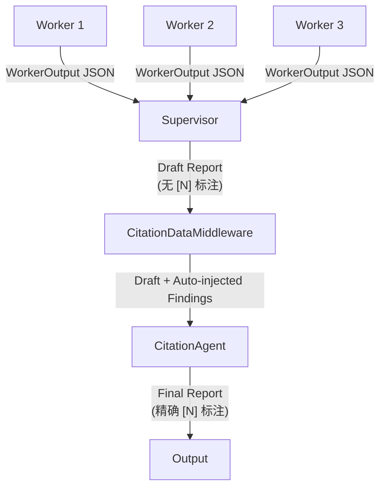

# Citation System Design — 引用准确性工程方案

> **状态**：设计阶段（Draft）
> **关联**：`deep_research_agent_iteration_roadmap.md` Phase 2.4 (Reflection Loop)
> **更新**：2026-05-02

---

## 一、问题定义

### 1.1 什么是"Citation 错乱"

Deep Research Agent 生成的最终报告中，inline citation `[N]` 与 Sources 列表中的条目之间存在以下类型的错误：

| 错误类型 | 描述 | 严重度 | 示例 |
|----------|------|--------|------|
| **引用断裂** | 正文中引用了 `[N]`，但 Sources 列表中不存在编号 N | 🔴 高 | 正文引用 `[19]`，Sources 列表只到 `[17]` |
| **编号冲突** | 多个 Worker 各自使用 `[1]`, `[2]`... 编号，合并时碰撞 | 🔴 高 | Worker A 的 `[1]` = `a.com`，Worker B 的 `[1]` = `b.com` |
| **张冠李戴** | `[N]` 旁边的事实主张并非来自 Source N 对应的文章 | 🔴 高 | 声称"根据 [3]，GPT-4 的参数量为..."，但 Source [3] 根本没提过参数量 |
| **孤儿 Source** | Sources 列表中存在未被正文引用的条目 | 🟡 中 | Source [5] 存在，但正文中从未出现 `[5]` |
| **格式不一致** | 不同 Worker 使用不同的引用格式 | 🟡 中 | Worker A 用 `[1]`，Worker B 用 `(Source: URL)` |

### 1.2 历史记录

在之前的 benchmark 评测中，这个问题已有实证记录：

- **`multi_hop_001`**：正文引用了 `[19]`，但参考文献列表只到 `[17]`，存在引用断裂。Judge 正确地在 citation 维度打了 0.4 分。
- 该问题在 [section7_llm_as_judge_answers.md](file:///home/tianwei/workspace/deep_research_agent/docs/mock_interview/section7_llm_as_judge_answers.md) 中有详细分析。

---

## 二、根因分析

### 2.1 信息传递链路中的 Provenance 丢失

Citation 错乱的**根本原因**是：fact-to-source 的映射关系在信息传递链路中逐步退化。

```
Search Tool
│ 返回 {url, title, snippet, content}      ← fact-source 映射 100% 准确
│
▼
Worker LLM
│ 阅读多个 search results → 提取事实 → 写 findings
│                                           ← LLM 综合时映射开始模糊
▼
ToolMessage
│ 仅返回 worker 最终文本（纯 string）      ← raw search results 完全丢失
│
▼
Supervisor LLM
│ 看到多个 worker 文本 → 综合写报告 + 标注 [N]
│                                           ← 二手信息再加工，映射严重退化
▼
Final Report
│ [3] 标注到底对不对？                      ← 无从验证
```

### 2.2 旧版 vs 新版架构的差异

| 对比项 | 旧版（手搓 Orchestrator + Composer） | 新版（`create_deep_agent`） |
|--------|--------------------------------------|---------------------------|
| **报告生成者** | 独立 `Composer` 节点 | Supervisor LLM 自身 |
| **Worker 结果传递** | `state["todos"]` 中的 structured findings | `ToolMessage` — worker 最后一条 AI message 的 `.text` |
| **引用合并机制** | Composer 手动拼接多个 Worker 输出（无 remap） | Supervisor 在上下文窗口中看到所有 worker 返回，自行综合 |
| **独立 Citation 指令** | Composer prompt 有专门的格式要求 | 仅 Supervisor prompt §5 中一行指令 |

**结论**：新版将"盲目拼接"问题改为"依赖 LLM 理解力"，概率性改善但无结构性保障。

### 2.3 当前 Citation 指令的不足

Supervisor prompt 中对 citation 的要求仅一行（`deep_agent.py` L184）：

```
4. **Citations**: Always cite sources inline (e.g., `[1]`, `[2]`).
   Provide the full source URL in the final Sources section.
```

**缺失**：
- 未要求对多个 Worker 的引用进行 dedup/remap
- 未要求 citation 编号必须连续且与 Sources 列表一一对应
- 未要求验证所有正文 citation 编号都在 Sources 中有条目

Worker prompt（`deep_agent.py` L214）：

```
Source URL Retention: You MUST include the source URL for every fact you report.
```

**缺失**：
- 未强制一个标准化的引用格式（如 claim-source 绑定结构）
- Worker 的 LLM 可能用各种格式（inline URL、footnote、numbered list）

---

## 三、设计决策：Worker 该做总结还是返回原始结果？

### 3.1 两个极端的分析

#### 极端 A：Worker 直接返回原始搜索结果

```
Worker → search("topic") → 10 results (title, url, snippet, content)
       → 直接把 raw results 塞进 ToolMessage 返回给 Supervisor
```

| 优点 | 缺点 |
|------|------|
| fact-source 映射 100% 保留 | Token 爆炸：10 条 raw_content 轻松 50K-100K tokens |
| Supervisor 可直接验证 | 噪声巨大：网页包含导航栏、广告、无关段落 |
| | 多跳搜索链断裂：Worker 退化为透传管道 |
| | 浪费 Worker 的 LLM 调用费用 |

#### 极端 B：Worker 完全消化后只返回自由文本叙述（当前做法）

```
Worker → search → search → search → 综合三轮搜索结果
       → 返回一段自然语言 narrative
```

| 优点 | 缺点 |
|------|------|
| Token 高效 | fact-source 映射丢失 |
| 噪声过滤 | 不可验证：无法判断是忠实摘要还是 Worker 幻觉 |
| 多跳搜索能力保留 | 原始证据消失：下游不可能做 citation grounding |

### 3.2 正确答案：有结构的总结（保留 Provenance）

**核心原则**：

> Worker 负责 **"读"和"提取"**，但必须保留 provenance（出处追溯）。
> Supervisor 负责 **"组织"和"写"**，依赖 Worker 提供的 provenance 做 citation。

Worker 的输出应该从自由文本改为 **Pydantic structured output**，通过 `response_format=WorkerOutput` 产生 **claim-source-evidence 结构化 JSON**：

```json
{
  "summary": "LangGraph v0.2 引入了 checkpointing 机制...",
  "findings": [
    {
      "claim": "LangGraph v0.2 引入了 checkpointing 机制，支持 MemorySaver 和 PostgresSaver",
      "source_urls": ["https://langchain.com/docs/langgraph/checkpointing"],
      "evidence": "LangGraph provides two built-in checkpointer implementations..."
    },
    {
      "claim": "Checkpointing 粒度为每个 super-step 保存一次完整 state snapshot",
      "source_urls": ["https://blog.langchain.com/langgraph-persistence"],
      "evidence": "After each super-step, the entire state is serialized..."
    },
    {
      "claim": "PostgresSaver 支持并发写入和 connection pooling",
      "source_urls": ["https://github.com/langchain-ai/langgraph/blob/main/docs/..."],
      "evidence": "PostgresSaver uses asyncpg with configurable pool size..."
    }
  ],
  "sources_consulted": [
    "https://langchain.com/docs/langgraph/checkpointing — LangGraph official docs",
    "https://blog.langchain.com/langgraph-persistence — LangChain blog"
  ],
  "caveats": ""
}

### 3.3 为什么 Claim-Source-Evidence 三元组是最优解

| 维度 | 纯叙述（现状） | 原始结果 | Pydantic Structured Output |
|------|--------------|---------|----------------------------|
| Token 效率 | ✅ 最优 | ❌ 最差 | ✅ 接近纯叙述（+20-50%） |
| Provenance 保留 | ❌ 丢失 | ✅ 完整 | ✅ claim 级别保留 |
| 解析可靠性 | N/A | ❌ 可能失败 | ✅ 100%（Pydantic schema 保证） |
| 噪声过滤 | ✅ 已过滤 | ❌ 全量噪声 | ✅ 已过滤 |
| 多跳搜索能力 | ✅ 保留 | ❌ 断裂 | ✅ 保留 |
| 下游 Citation | ❌ 靠猜 | ✅ 精确 | ✅ 精确 |
| 可验证性 | ❌ 不可 | ✅ 完全 | ✅ 通过 evidence 验证 |
| 1:N Source 映射 | ❌ 不支持 | ✅ 支持 | ✅ `source_urls: list[str]` |

---

## 四、Citation 验证的三个层次

### 4.1 层次定义

| 层次 | 名称 | 验证内容 | 实现复杂度 |
|------|------|---------|-----------|
| **L1** | 结构性验证 | 正文 `[N]` 编号 ↔ Sources 列表条目的映射完整性 | 🟢 低（正则） |
| **L2** | 语义归属验证 | `[N]` 旁边的事实主张是否**真的来自** Source N | 🟡 中（需 evidence） |
| **L3** | 内容真实性验证 | Source N 的网页内容是否**真的包含** evidence 中引用的原文 | 🔴 高（需回溯原始 URL） |

### 4.2 L1：结构性验证（正则 + 编号连续性）

可自动化，无需 LLM：

```python
import re

def validate_citation_structure(report: str) -> dict:
    """验证引用编号的结构完整性。"""
    # 提取正文中所有 [N] 引用
    body_citations = set(int(m) for m in re.findall(r'\[(\d+)\]', body_section))

    # 提取 Sources 列表中的编号
    source_entries = set(int(m) for m in re.findall(r'^\[(\d+)\]', sources_section, re.MULTILINE))

    return {
        "orphan_citations": body_citations - source_entries,    # 正文引用了但 Sources 没有
        "orphan_sources": source_entries - body_citations,      # Sources 有但正文没引用
        "is_sequential": source_entries == set(range(1, max(source_entries) + 1)),  # 编号是否连续
    }
```

**局限**：只能发现"断裂"和"孤儿"，无法判断 `[3]` 是否标注在了正确的事实旁边。

### 4.3 L2：语义归属验证（依赖 Claim-Source-Evidence）

需要 Worker 提供 claim-source-evidence 三元组后才可实现。

验证逻辑：对于报告中每个 `[N]` 标注的句子，检查该句的语义是否与 Worker 提供的 claim-source 映射一致。

```
Report 中: "LangGraph 支持两种 checkpointer 后端 [3]"
Worker findings 中: Claim="LangGraph 支持 MemorySaver 和 PostgresSaver"
                    Source=https://langchain.com/docs/checkpointing

→ 验证: Report 句子 ≈ Worker claim? ✅
→ 验证: Source [3] = https://langchain.com/docs/checkpointing? ✅
→ 结论: Citation [3] 语义归属正确
```

**实现方式**：可以用 LLM 做 pairwise comparison，也可以用 embedding 相似度做粗筛。

### 4.4 L3：内容真实性验证（需要回溯原始 URL）

最严格的验证——检查 Worker 声称的 evidence 是否真的存在于源网页中。

```
Worker Evidence: "LangGraph provides two built-in checkpointer implementations..."
Source URL: https://langchain.com/docs/checkpointing

→ 抓取 URL 内容
→ 全文搜索 evidence 片段
→ 匹配到? ✅ Citation 内容真实
```

**局限**：
- 需要额外的 HTTP 请求（latency + cost）
- 网页内容可能已变更（time-of-check vs time-of-use）
- 付费墙/登录墙后的内容无法访问

---

## 五、CitationAgent 架构设计

### 5.1 为什么需要独立 CitationAgent

当前架构要求 Supervisor **同时做两件认知任务**：

1. **Synthesis**：将多个 Worker 的发现综合成连贯报告
2. **Attribution**：为每个事实主张正确标注来源

这两个任务有**认知冲突**：
- Synthesis 需要关注叙事连贯性、信息组织、去重
- Attribution 需要逐字逐句追溯"这句话来自哪个 Worker 的哪个 Source"

分离后，每个 Agent 的认知负载降低，准确性提升。

### 5.2 工作流程



**CitationAgent 的输入**（由 `CitationDataMiddleware` 自动组装）：
1. Supervisor 生成的 **draft report**（纯文字，不含任何 `[N]` 标注）— 来自 task description
2. 所有 Worker 的 **WorkerOutput JSON**（结构化数据）— 由 middleware 从 state.messages 中自动提取注入

**CitationAgent 的处理步骤**：
1. 逐句扫描 draft report
2. 对每个事实性声明，在 Worker findings JSON 中查找**最匹配的 evidence**
3. 分配唯一、连续的编号，添加 inline citation `[N]`
4. 生成 Sources 列表（格式：`[N] Title — URL`），确保编号连续且每个 `[N]` 都有对应条目

> **注**：CitationAgent **不做** L1 结构性验证。编号连续性、孤儿 [N] 等检查由 [03_citation_validation_design.md](./03_citation_validation_design.md) 负责。

**关键优势**：
- **单一认知任务**：CitationAgent 只做 attribution，全部 attention 集中在 fact-source 匹配上
- **有原始 evidence**：能直接对比 report 句子和 Worker 的 evidence 片段
- **零信息损失**：`CitationDataMiddleware` 从 ToolMessage 中直接提取原始 JSON，避免 Supervisor LLM "复制"时的信息篡改
- **后处理视角**：在完整报告上做 citation，能看到全局上下文，自然避免编号冲突

### 5.3 在 `create_deep_agent` 架构下的实现路径

> [!IMPORTANT]
> **架构纠正**：CitationAgent 不应作为外部后处理，而应作为 Agent 系统内部的 subagent。
> Agent 系统应该是自洽的——自己产出完整、可信的报告，不依赖外部编排。

CitationAgent 通过 `create_deep_agent` 的 `subagents` 参数注册，与 research-worker 平级：

```python
subagents=[
    research_worker_spec,       # 研究型 worker
    citation_specialist_spec,   # citation 标注 worker
]
```

Supervisor **始终**在所有研究 Worker 完成后委派 citation-specialist（默认触发，无条件判断）：

```
Supervisor → task(research-worker, "研究 topic A") → findings A
Supervisor → task(research-worker, "研究 topic B") → findings B
Supervisor → 综合 findings，写 draft report（无 [N] 标注）
Supervisor → task(citation-specialist, draft report) → final report
          ↑ CitationDataMiddleware 自动注入 Worker findings
```

`CitationDataMiddleware` 通过 `wrap_tool_call` 拦截 citation-specialist 的 task 调用，自动从 Supervisor state 的 messages 中提取 Worker findings JSON 并追加到 description。Supervisor 无需手动复制 findings。

详细设计见 [02_citation_annotation_design.md](./02_citation_annotation_design.md)。

### 5.4 CitationAgent 的局限

| 局限 | 说明 | 缓解 |
|------|------|------|
| 额外 LLM 调用 | 增加 latency + cost（约 1 次调用，≤ 10% 成本增幅） | 使用轻量模型（如 DeepSeek-V3 Chat） |
| 依赖 Worker 输出质量 | 如果 Worker 的 evidence 本身就是错的，CitationAgent 也无法修正 | L3 验证（回溯原始 URL）|
| Supervisor 降级路径 | CitationAgent 执行失败时需要 Supervisor 自行标注 | Supervisor prompt §6.1 定义详细的 self-citation 格式规则 |

---

## 六、渐进式实施路线图

### Phase 1：Prompt 层修复（1-2 天）

**目标**：从源头减少 citation 错乱的概率

1. **改造 Worker prompt**：要求 Worker 以 claim-source-evidence 三元组格式输出
2. **强化 Supervisor prompt**：增加 citation 合并、编号连续性、dedup 等明确指令
3. **统一引用格式**：Worker 不用编号引用，改用 inline URL `(Source: URL)`，避免跨 Worker 编号冲突

```diff
# Worker Prompt 变更
- **Source URL Retention**: You MUST include the source URL for every fact you report.
+ ## Output Rules
+ - Your output MUST conform to the structured schema provided.
+ - Each Finding must have at least one source URL.
+ - A Finding may have multiple source URLs if supported by multiple sources.
+ - Evidence should be a brief quote or close paraphrase.
+ - DO NOT use numbered citations like [1], [2] anywhere in your output.
+ - For paywalled sources, use the accessible secondary source URL.
```

```diff
# Worker SubAgent 注册变更
  research_subagent: dict[str, Any] = {
      "name": "research-worker",
      ...
+     "response_format": WorkerOutput,  # Pydantic structured output
  }
```

```diff
# Supervisor Prompt 变更 (§5 Report Quality Requirements)
- 4. **Citations**: Always cite sources inline (e.g., `[1]`, `[2]`).
-    Provide the full source URL in the final Sources section.
+ 4. **Citations**:
+    - Assign a unique, sequential number `[1]`, `[2]`, ... to each distinct source URL.
+    - Every factual claim MUST have an inline citation.
+    - The Sources section MUST list every cited URL with its number.
+    - Every `[N]` in the text MUST have a corresponding entry in Sources.
+    - Every entry in Sources MUST be referenced at least once in the text.
+    - Numbers MUST be sequential with no gaps (1, 2, 3... not 1, 3, 5).
+    - When multiple workers cite the same URL, use the SAME number.
```

### Phase 2：L1 结构性验证（1 天）

**目标**：自动检测并报告 citation 结构问题

- 在 `stream_deep_research` 的 `final_report` 事件前执行正则验证
- 检查：编号断裂、孤儿 source、编号连续性
- 验证失败时记录 warning log（不阻塞输出）

### Phase 3：CitationAgent 引入（3-5 天）

**目标**：将 citation 标注从 Supervisor 中分离

- 定义 `DeepAgentPrompts.CITATION_SPECIALIST` prompt
- 在 `build_deep_agent()` 中注册 citation-specialist subagent（`tools=[]`，无 `response_format`）
- 实现 `CitationDataMiddleware`：自动注入 Worker findings 到 CitationAgent 输入
- 修改 Supervisor prompt：增加 §6 Citation Workflow（默认触发）+ §6.1 Self-Citation Fallback
- L1 验证由 03_citation_validation_design.md 负责，CitationAgent 不做自检

### Phase 4：L2/L3 验证（可选，长期）

**目标**：端到端的引用内容真实性保障

- L2：用 embedding 或 LLM 做 claim vs evidence 的语义匹配验证
- L3：回溯原始 URL 验证 evidence 是否真实存在于网页中

---

## 七、待确认的设计决策

> [!IMPORTANT]
> 以下决策需要在实施前确认

### D1：Worker 输出格式

- **决策**：✅ **Pydantic `response_format=WorkerOutput`**——`deepagents` 的 `SubAgent` 支持 `response_format` 参数，100% 可解析
- `Finding` schema 包含 `claim`, `source_urls: list[str]`, `source_titles: list[str]`, `evidence`

### D2：CitationAgent 的模型选择

- **决策**：✅ **轻量模型**（如 DeepSeek-V3 Chat）— citation 标注是相对简单的 NLU 任务，不需要强推理能力

### D3：验证失败时的策略

- **决策**：✅ Phase 1-2 选 **Log warning + 原样输出**，Phase 3 考虑 Self-correction loop（最多 1 次 retry）

### D4：Summarization 对 Citation 的影响

- **决策**：✅ **CitationDataMiddleware 方案**——middleware 在 `wrap_tool_call` 中直接从 state.messages 提取 Worker ToolMessage，不依赖 state 扩展，不受 SummarizationMiddleware 影响
- 原 "State 扩展" 方案因 `AgentState` TypedDict 限制被否决

### D5：CitationAgent 触发条件

- **决策**：✅ **默认触发**——所有研究场景都委派 citation-specialist，不做条件分类

### D6：Sources 列表格式

- **决策**：✅ **`[N] Title — URL`**——`Finding.source_titles` 新增字段提供 title，无 title 时使用 URL domain 作 fallback

---

## 八、与 Anthropic Multi-Agent Research System 的对照

参照 [Anthropic 技术博客](https://www.anthropic.com/engineering/multi-agent-research-system) 的设计：

| 组件 | Anthropic 方案 | 我们的当前方案 | 改进方向 |
|------|---------------|---------------|---------|
| Worker 输出 | 结构化 findings + source attribution | ✅ Pydantic `WorkerOutput` structured output | 已实现 |
| Citation 标注 | 独立 CitationAgent（subagent） | ✅ citation-specialist subagent + CitationDataMiddleware | 已设计 |
| Citation 验证 | Citation-content 交叉验证 | → L1 结构验证 + L2 语义验证 | 03/04 设计中 |
| Source 保留 | Subagent output to filesystem | ✅ Pydantic Finding schema 保留 evidence + source_titles | 已设计 |

---

## 九、组件详细设计文档

| 组件 | 文档 | 核心内容 |
|------|------|---------|
| Worker 输出 | [01_worker_output_design.md](./01_worker_output_design.md) | Pydantic `WorkerOutput` / `Finding` schema、prompt 变更、解析策略 |
| Citation 标注 | [02_citation_annotation_design.md](./02_citation_annotation_design.md) | CitationAgent 作为 subagent 的架构、数据流、Supervisor 委派策略 |
| Citation 验证 | [03_citation_validation_design.md](./03_citation_validation_design.md) | L1/L2/L3 三层验证体系、实现代码、失败处理策略 |
| Source 保留 | [04_source_retention_design.md](./04_source_retention_design.md) | Provenance 保留策略、Summarization 影响缓解、去重机制 |
