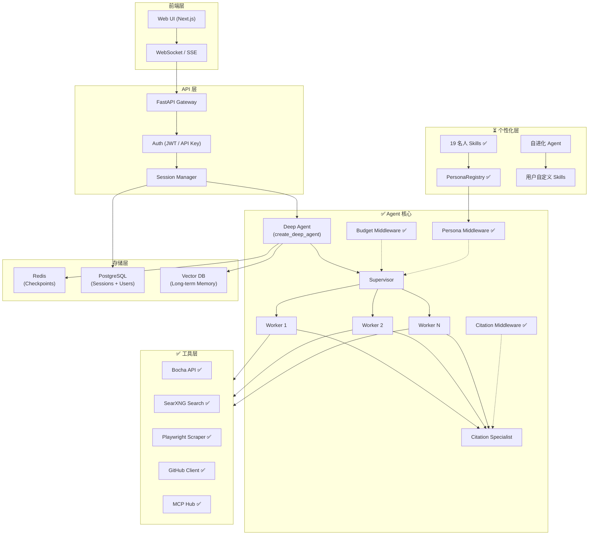

# Deep Research Agent — 项目状态分析与迭代路线图

> **Last Updated**: 2026-05-13
> **Current Milestone**: Phase 0 ✅ | Phase 1 部分完成 | Phase 2 部分完成 | Phase 3 部分完成

---

## 一、项目现状分析（As-Is）

### 1.1 代码库全景

```
deep_research_agent/                    # 总计 ~9,500 行 Python
├── agents/                             # 核心 Agent 层 (~2,300 行)
│   ├── __init__.py                     #   Package exports
│   ├── agent.py                        #   build_deep_agent + stream/run 入口 (440 行)
│   ├── prompts.py                      #   DeepAgentPrompts 类 (459 行)
│   ├── tools.py                        #   SearXNG + Playwright 工具工厂 (179 行)
│   ├── budget_middleware.py            #   动态 Budget 注入中间件 (207 行)
│   ├── persona_middleware.py           #   Persona 认知框架注入中间件 (124 行) ★ NEW
│   ├── patched_deepseek.py             #   DeepSeek V4 thinking-mode 兼容 (99 行)
│   ├── mcp_client.py                   #   MCPSearchClient (MCP 工具加载) ★ NEW
│   └── citation/                       #   引用子系统
│       ├── __init__.py
│       ├── citation_middleware.py       #     CitationDataMiddleware (385 行)
│       ├── models.py                   #     WorkerOutput / Finding Pydantic 模型 (247 行)
│       └── structure_validator.py      #     L1 结构校验 (207 行)
├── personas/                           # 名人认知框架库 ★ NEW
│   ├── __init__.py                     #   Package exports
│   ├── registry.py                     #   PersonaRegistry + PersonaConfig (113 行)
│   ├── registry.yaml                   #   声明式注册表 (19 个人格框架)
│   └── frameworks/                     #   上游 SKILL.md 框架文件 (19 files, ~200KB)
│       ├── buffett.md                  #     巴菲特 — 价值投资
│       ├── zhangxuefeng.md             #     张雪峰 — 职业规划
│       ├── feynman.md                  #     费曼 — 科学思维
│       └── ... (共 19 个)              #     详见 registry.yaml
├── search_service/                     # 自建搜索服务 (~1,850 行)
│   ├── __init__.py
│   ├── __main__.py                     #   python -m search_service 入口
│   ├── models.py                       #   SearchResponse, ScrapeResponse 等
│   ├── config.py                       #   SearchServiceConfig (pydantic-settings)
│   ├── exceptions.py                   #   7 种自定义异常
│   ├── cache.py                        #   CacheLayer Protocol + NullCache
│   ├── rate_limiter.py                 #   AsyncRateLimiter (token-bucket)
│   ├── result_filter.py                #   SearchResultFilter (去重/评分) ★ NEW
│   ├── server.py                       #   SearchMCPServer (FastMCP, 6 tools)
│   ├── backends/
│   │   ├── base.py                     #     SearchBackend Protocol + SearchRouter
│   │   ├── bocha_client.py             #     Bocha API 商业搜索后端 (224 行) ★ NEW
│   │   ├── searxng_client.py           #     SearXNG HTTP async client
│   │   ├── page_scraper.py             #     URL → Markdown (Playwright)
│   │   └── github_client.py            #     GitHub REST API client
│   ├── browser/
│   │   ├── pool.py                     #     BrowserPool (semaphore concurrency)
│   │   └── stealth.py                  #     StealthInjector
│   └── resources/                      #   stealth.min.js placeholder
├── benchmarks/                         # LLM-as-Judge 评测框架 (~604 行)
│   ├── __init__.py
│   ├── benchmark_case.py               #   BenchmarkCase 模型
│   ├── grader.py                       #   BenchmarkGrader (Gemini)
│   └── runner.py                       #   BenchmarkRunner
├── config/                             # 配置层
│   ├── settings.py                     #   Settings dataclass (144 行)
│   └── settings.yaml                   #   YAML 默认值
├── docker/                             # 容器化
│   ├── docker-compose.yml              #   SearXNG container
│   └── searxng/settings.yml            #   baidu+sogou+bing 搜索引擎
├── tests/                              # 测试套件 (~3,900 行, 255 tests)
│   ├── conftest.py
│   ├── test_budget_middleware.py        #   Budget 中间件 (260 行)
│   ├── test_patched_deepseek.py        #   DeepSeek 补丁 (152 行)
│   ├── test_grader.py                  #   Grader (256 行)
│   ├── test_citation/                  #   引用系统 (5 文件, ~1,239 行)
│   │   ├── test_citation_middleware.py
│   │   ├── test_models.py
│   │   ├── test_prompts.py
│   │   ├── test_structure_validator.py
│   │   └── test_agent_integration.py
│   └── test_search_service/            #   搜索服务 (13 文件, ~2,007 行)
│       ├── test_models.py
│       ├── test_config.py
│       ├── test_exceptions.py
│       ├── test_cache.py
│       ├── test_rate_limiter.py
│       ├── test_search_router.py
│       ├── test_searxng_client.py
│       ├── test_browser_pool.py
│       ├── test_page_scraper.py
│       ├── test_github_client.py
│       ├── test_server.py
│       └── test_agent_integration.py
├── examples/                           # 运行脚本
│   ├── run_deep_agent.py               #   主研究入口 (streaming)
│   └── run_benchmark.py                #   评测入口
├── scripts/                            # 工具脚本
│   ├── download_trace.py
│   ├── analyze_trace.py
│   ├── analyze_trace_triplets.py
│   ├── fetch_latest_trace.py
│   └── list_recent_runs.py
├── refactory_doc/                      # 设计文档
│   ├── citation/                       #   引用系统 4 阶段设计文档 (5 files)
│   ├── search_tools/                   #   搜索服务设计文档 (14 files)
│   ├── persona_skills/                 #   名人 Skills 集成方案 (5 chapters) ★ NEW
│   └── deep_research_agent_iteration_roadmap.md  # 本文档
├── docs/                               # 项目文档 (15 files)
└── market_research/                    # 竞品分析
```

### 1.2 技术栈

| 组件 | 技术 | 状态 |
|------|------|------|
| LLM | DeepSeek V4 (deepseek-chat) + PatchedChatDeepSeek | ✅ 生产中 |
| Agent 框架 | LangGraph + `deepagents.create_deep_agent` | ✅ 统一路径 |
| 搜索工具 | Bocha API (主) + SearXNG (备) + Playwright scraper | ✅ 双后端 |
| MCP 协议 | `langchain-mcp-adapters` + MCPSearchClient | ✅ 已集成 |
| 可观测性 | LangSmith / LangChain Tracing + run_id capture | ✅ 全链路 |
| 中间件 | PersonaMiddleware + BudgetTracking + CitationData | ✅ 三层中间件 |
| 引用系统 | Citation Specialist + WorkerOutput Pydantic | ✅ 已集成 |
| 人格框架 | PersonaRegistry + 19 个名人 Skills + registry.yaml | ✅ 已集成 |
| 评测 | LLM-as-Judge (Gemini) + BenchmarkRunner | ✅ 可运行 |
| 配置 | YAML + dataclass + pydantic-settings | ✅ 双层配置 |
| 测试 | pytest + pytest-asyncio (255 tests) | ✅ 全通过 |
| 前端 | **无** | ❌ |
| 数据库 | **无** | ❌ |
| 状态持久化 | MemorySaver 已支持 (thread-id CLI 参数) | ⏳ 内存态 |
| 用户系统 | **无** | ❌ |

### 1.3 关键问题诊断（更新）

| # | 问题 | 严重度 | 状态 |
|---|------|--------|------|
| ~~1~~ | ~~双架构共存~~ | ~~🔴 高~~ | ✅ **已解决** — `orchestrator/` + `worker/` + `tools/` 已删除 |
| 2 | **单轮对话** | 🔴 高 | ⏳ `thread_id` + `MemorySaver` 已集成，内存态多轮对话可工作 |
| 3 | **无状态持久化** | 🔴 高 | ⏳ 内存态 MemorySaver 已可用，Redis/PG 未实现 |
| 4 | **无前端** | 🟡 中 | ❌ 未开始 |
| ~~5~~ | ~~工具单一~~ | ~~🟡 中~~ | ✅ **已改善** — Bocha 商业搜索 + SearXNG 备用 + Playwright Scraper，双后端架构 |
| 6 | **无用户系统** | 🟡 中 | ❌ 未开始 |
| ~~7~~ | ~~测试覆盖不足~~ | ~~🟡 中~~ | ✅ **已解决** — 255 tests, search_service + citation + budget 全覆盖 |
| 8 | **无上下文管理** | 🟡 中 | ❌ 未开始 |
| ~~9~~ | ~~Tavily 残留~~ | ~~🟢 低~~ | ✅ **已解决** — 已迁移至 Bocha API，SearXNG 作为 fallback |

---

## 二、迭代路线图（优先级排序）

### Phase 0：地基清理 ✅ 已完成

| # | 任务 | 状态 | 关键产出 |
|---|------|------|----------|
| 0.1 | 统一架构到 `agents/` 扁平路径 | ✅ | `agents/agent.py` 单一入口 |
| 0.2 | 清理 `orchestrator/` `worker/` `tools/` | ✅ | 完全删除，无残留 |
| 0.3 | 更新 README、tests、examples | ✅ | `run_deep_agent.py` + `run_benchmark.py` |
| 0.4 | 提取 prompts 到独立模块 | ✅ | `agents/prompts.py` (DeepAgentPrompts 类) |
| 0.5 | Budget 中间件 (动态 turn limit 注入) | ✅ | `agents/budget_middleware.py` |
| 0.6 | Citation 中间件 + WorkerOutput 结构化 | ✅ | `agents/citation/` 子包 |
| 0.7 | DeepSeek V4 thinking-mode 兼容 | ✅ | `agents/patched_deepseek.py` |
| 0.8 | LangSmith run_id 捕获 | ✅ | `stream_deep_research` 产出 `run_id` 事件 |

**超出原计划的额外完成项（原属 Phase 1/2）**:

| # | 任务 | 原计划 Phase | 状态 |
|---|------|:---:|
| ★ | 流式输出 (astream_events) | Phase 1 | ✅ `stream_deep_research()` async generator |
| ★ | SearXNG 替换 Tavily (自建搜索) | Phase 2 | ✅ 完整 `search_service/` 包 |
| ★ | Bocha API 商业搜索后端 | Phase 2 | ✅ `bocha_client.py` + 双后端路由 |
| ★ | MCP Protocol 正式接入 | Phase 2 | ✅ `MCPSearchClient` + `langchain-mcp-adapters` |
| ★ | Playwright URL Scraper | Phase 2 | ✅ `scrape_url` 深度提取工具 |
| ★ | MCP Server 骨架 | Phase 2 | ✅ 6 tools registered |
| ★ | GitHub REST API Client | Phase 2 | ✅ `search_service/backends/github_client.py` |
| ★ | Docker 化搜索基础设施 | Phase 2 | ✅ SearXNG docker-compose |
| ★ | 名人 Skill 人格框架系统 | Phase 3 | ✅ PersonaMiddleware + 19 personas |
| ★ | 多轮对话 (MemorySaver) | Phase 1 | ✅ `--thread-id` CLI 参数 |

---

### Phase 1：核心体验（2 周）— ⏳ 部分完成

| # | 任务 | 状态 | 依赖 | 工作量 |
|---|------|------|------|--------|
| ~~1.3~~ | ~~流式输出~~ | ✅ 已在 Phase 0 完成 | — | — |
| ~~1.1~~ | ~~多轮对话 + Checkpointer~~ | ✅ MemorySaver + `--thread-id` CLI | 无 | — |
| 1.2 | Human-in-the-Loop (研究计划审阅/修改) | ❌ | 1.1 | 3-4 天 |
| 1.4 | MVP 前端 (Streamlit / FastAPI + React) | ❌ | 1.1 | 3-7 天 |
| 1.5 | Redis Checkpointer 持久化 | ❌ | 1.1 | 0.5 天 |

> [!TIP]
> 1.1 多轮对话已完成——`run_deep_agent.py --thread-id my-session` 可用，`MemorySaver()` 已实例化。下一步是将 `MemorySaver` 升级为 Redis/PostgreSQL 持久化。

---

### Phase 2：稳定性与扩展（2 周）— ⏳ 大部分完成

| # | 任务 | 状态 | 备注 |
|---|------|------|------|
| ~~2.2~~ | ~~更多工具接入 (URL Reader)~~ | ✅ 已完成 | `scrape_url` Playwright 工具 |
| ~~2.9~~ | ~~MCP Protocol 正式接入~~ | ✅ 已完成 | `MCPSearchClient` + `langchain-mcp-adapters` |
| ~~2.10~~ | ~~Bocha API 商业搜索后端~~ | ✅ 已完成 | `bocha_client.py` + 双后端路由 + 并发控制 |
| 2.1 | 上下文管理 (Token 截断 + 摘要) | ❌ | |
| 2.3 | 错误恢复与重试 | ⏳ 部分 | Timeout recovery 已有，Worker 级 retry 未做 |
| 2.4 | 研究质量自检 (Reflection Loop) | ❌ | |
| 2.5 | 成本监控 Dashboard | ❌ | |
| 2.6 | 历史 Session 管理 + PostgreSQL | ❌ | 依赖 Phase 1 |
| 2.7 | 安全审计基础 | ❌ | |
| 2.8 | 中文平台 Scrapers (知乎/微博/微信) | ❌ | 当前用 `site:` fallback |

---

### Phase 3：差异化与个性化（2-3 周）— ⏳ 部分完成

| # | 任务 | 状态 | 备注 |
|---|------|------|------|
| 3.1 | 用户管理 (API Key → OAuth) | ❌ | |
| ~~3.2~~ | ~~Skill 系统 (名人 skill 蒸馏框架)~~ | ✅ 已完成 | PersonaMiddleware + PersonaRegistry + 19 personas |
| 3.3 | 多模型路由 (Model Router) | ❌ | |
| 3.4 | 报告导出与分享 | ❌ | |
| 3.5 | MCP 接入 (GitHub / Notion / ArXiv) | ⏳ | MCP 基础设施已就绪，待扩展工具源 |
| 3.6 | 长期记忆 (向量数据库) | ❌ | |

> [!NOTE]
> **3.2 Skill 系统已完成的内容**：
> - 实现了 `PersonaMiddleware`，通过 `wrap_model_call` 在 Supervisor system prompt 中注入名人认知框架
> - 创建了 `personas/` 数据层：PersonaRegistry + PersonaConfig + registry.yaml + 19 个框架文件
> - 添加了 SUPERVISOR prompt §8 Hook，引导 LLM 遵循注入的分析框架
> - 支持 `--persona buffett/zhangxuefeng/feynman/...` CLI 参数
> - **已知问题**：上游 .skill 文件包含角色扮演指令（“以张一鸣身份回应”）与 Supervisor 角色冲突，导致框架遵循度不足。待优化的方向：添加框架翻译层抑制角色扮演指令，仅保留分析维度和心智模型。
> - 详细设计文档见 `refactory_doc/persona_skills/`（5 章）

---

### Phase 4：自进化（长期）— ❌ 未开始

| # | 任务 | 状态 |
|---|------|------|
| 4.1 | 用户行为追踪与分析 | ❌ |
| 4.2 | 研究方法论自动蒸馏 (Hermas-style) | ❌ |
| 4.3 | Skill 自动生成 + 效果评估 | ❌ |
| 4.4 | 多语言研究能力 | ❌ |
| 4.5 | Agent 自评估与性能优化闭环 | ❌ |

---

## 三、Tech Debt 追踪

| Item | 描述 | 优先级 | 状态 |
|:-----|:-----|:------:|:----:|
| ~~Tavily 字段残留~~ | ~~`Settings` + `settings.yaml` 中保留 tavily 字段~~ | ~~Low~~ | ✅ 已迁移至 Bocha |
| ~~`verify_orchestrator.py`~~ | ~~`examples/` 中残留旧入口脚本的日志文件~~ | ~~Low~~ | ✅ 已清理 |
| NullCache | 搜索服务无实际缓存，重复查询产生冗余请求 | Medium | ❌ |
| BrowserPool 生命周期 | `make_scrape_url` 创建的 pool 无显式 shutdown hook | Medium | ❌ |
| stealth.min.js | 需手动 `npx extract-stealth-evasions` 生成 | Low | ❌ |
| AsyncRateLimiter | 简单 token-bucket，需升级到 sliding window | Medium | ❌ |
| Persona 角色冲突 | 上游 .skill 文件含角色扮演指令，与 Supervisor 角色冲突，导致框架遵循度不足 | High | ⏳ 待添加翻译层 |
| Persona Token 开销 | 框架文件 2-4.5K tokens/persona，未实施自动摘要压缩 | Low | ❌ |

---

## 四、量化指标

| 指标 | 数值 |
|------|------|
| Python 源码总行数 | ~9,500 |
| Agent 核心代码 | ~2,300 行 (agents/) |
| 搜索服务代码 | ~1,850 行 (search_service/) |
| 人格框架数据 | ~200KB (personas/frameworks/) |
| 测试代码 | ~3,900 行 (tests/) |
| 评测框架代码 | ~604 行 (benchmarks/) |
| 测试用例数 | 255 (全通过) |
| 注册人格框架数 | 19 |
| 中间件数 | 3 (Persona + Budget + Citation) |
| Python 源文件数 | 72 |
| Git 提交数 (main) | 15+ |
| 设计文档数 | 25+ (refactory_doc/) |

---

## 五、技术架构愿景



---

## 六、下一步行动建议

### 立即启动

1. **Persona 框架翻译层** — 在 `PersonaMiddleware._build_persona_block()` 中添加指令抑制上游 `.skill` 中的角色扮演指令（"以某人身份回应"），仅保留分析维度和心智模型。这是当前框架遵循度不足的根因
2. **研究报告质量基线** — 用现有 benchmark 框架跑一轮基线评测，量化有/无 persona 时的报告差异
3. **调优研究参数** — `supervisor_max_turns` 和 `research_timeout_seconds` 需根据查询复杂度动态调整，当前固定值（5/100s）过低

### 下周启动

4. **MVP 前端** — Streamlit demo (3 天)，验证 streaming + 多轮交互 + persona 选择 UI
5. **Human-in-the-Loop** — Supervisor 阶段增加 `interrupt`，支持用户审阅研究计划
6. **Redis Checkpointer** — 替换 MemorySaver，实现跨进程状态持久化和崩溃恢复

### 两周内完成

7. **上下文管理** — Token 截断 + findings 摘要压缩
8. **Persona 效果评估** — 设计独立评分维度（framework_coherence, persona_fidelity, actionability）
9. **Reflection Loop** — Critic 节点质量自检
