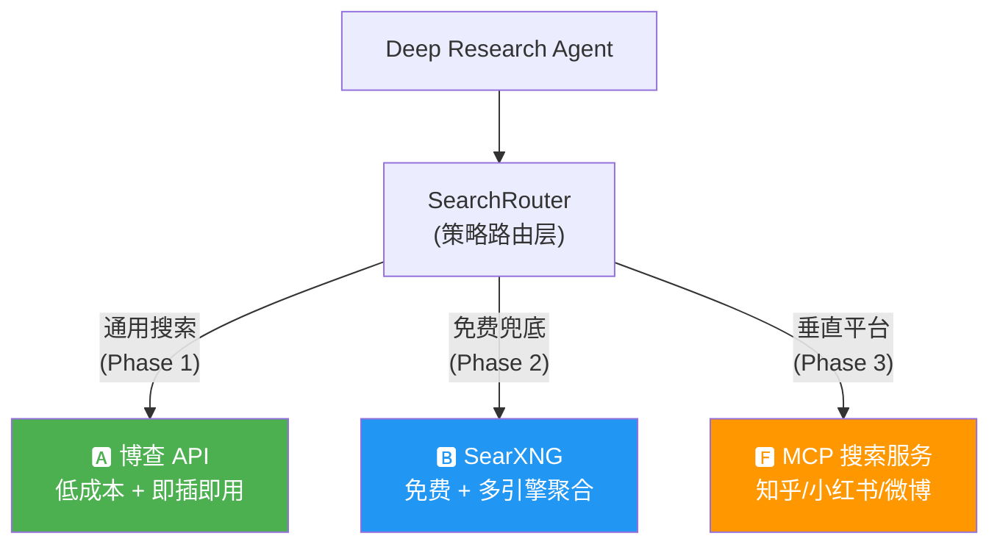

# Deep Research Agent 搜索方案替代分析

> **目标**：为部署在中国大陆的 deep_research_agent 系统找到 Tavily Search API 的替代方案，实现低成本/免费的搜索能力。

---

## 1. 当前状态分析

### 1.1 Tavily 在系统中的集成方式

当前系统通过 [tools.py](file:///home/tianwei/workspace/deep_research_agent/agents/tools.py) 中的 `_make_internet_search()` 工厂函数创建搜索工具：

```python
def _make_internet_search(api_key: str):
    from tavily import TavilyClient
    client = TavilyClient(api_key=api_key)
    
    def internet_search(query, max_results=10, topic="general", include_raw_content=False) -> dict:
        return client.search(query, max_results=max_results, ...)
    
    return internet_search
```

**关键接口契约**：搜索工具本质上只是一个 `(query: str, ...) -> dict` 的函数，传入 `create_deep_agent` 的 `tools` 参数。这意味着 **替换搜索后端只需要替换这个工厂函数**，对上游架构零侵入。

### 1.2 Tavily 的当前成本

| 项目 | 数据 |
|:---|:---|
| 免费额度 | 1,000 credits/月 |
| Basic Search | 1 credit/次 |
| Advanced Search | 2 credits/次 |
| 超额费率 | ~$0.008/credit |
| 付费起步 | $30/月 (4,000 credits) |
| 中国大陆可访问性 | ⚠️ **不稳定**，部分网络环境下无法连接 api.tavily.com |

> [!WARNING]
> Tavily 在中国大陆的访问不稳定是一个 **生产环境的致命风险**。即便价格可接受，网络可达性问题也必须解决。

---

## 2. 候选方案全景

### 方案速览表

| # | 方案 | 类型 | 🇨🇳 可访问 | 💰 成本 | 🔧 实现复杂度 | 🖥️ 需额外服务器 |
|---|------|------|:---:|:---:|:---:|:---:|
| A | **博查 (Bocha) Search API** | 商业 API | ✅ 原生 | 低 | ⭐ 极低 | ❌ |
| B | **SearXNG 自建** | 自托管元搜索 | ✅ 自建 | 免费 | ⭐⭐⭐ 中 | ✅ |
| C | **DuckDuckGo (ddgs)** | 开源爬取 | ❌ 被墙 | 免费 | ⭐ 极低 | ❌ |
| D | **Brave Search API** | 商业 API | ❌ 被墙 | 低 | ⭐ 极低 | ❌ |
| E | **Serper.dev (Google SERP)** | 商业 API | ❌ 被墙 | 低 | ⭐ 极低 | ❌ |
| F | **自建 MCP 搜索服务** | 自研爬虫 | ✅ 自建 | 免费 | ⭐⭐⭐⭐⭐ 高 | ✅ |
| G | **Jina AI Search (s.jina.ai)** | 商业 API | ❌ 被墙 | 低 | ⭐ 极低 | ❌ |

> [!IMPORTANT]
> 经过网络可达性验证，**C/D/E/G 四个方案在中国大陆均无法直接访问**（被 GFW 屏蔽或连接极不稳定）。在不使用海外代理的前提下，**只有 A、B、F 三个方案是真正可行的**。

---

## 3. 可行方案详细分析

---

### 方案 A：博查 (Bocha) Search API 🏆 推荐

**概述**：博查是国内专门面向 AI Agent / RAG 场景的搜索 API 服务商，已被 DeepSeek 官方采用为联网搜索供应方，阿里/腾讯/字节生态均有集成。

#### 优势
- ✅ **中国大陆原生可用**：服务器部署在国内，零延迟，零封锁风险
- ✅ **接口设计对标 Tavily**：返回结构化 JSON（title, url, content, snippet），与当前系统接口契约完美匹配
- ✅ **实现复杂度极低**：替换 `_make_internet_search()` 内的 HTTP 调用即可，约 30 行代码改动
- ✅ **AI 优化**：搜索排序基于 Transformer 架构，对语义相关性理解好
- ✅ **数据合规**：数据不出海，符合国内安全法规
- ✅ **附加能力**：AI Search API 可返回垂直领域结构化模态卡（天气、百科、股票等）

#### 劣势
- ⚠️ **非免费**：约 ￥0.036/次调用（~$0.005），与 Tavily 的 $0.008 相比便宜约 37%
- ⚠️ **预付费模式**：需先充值，不如 Tavily 的订阅制灵活
- ⚠️ **供应商锁定**：国内小厂，长期存续风险相比国际大厂更高
- ⚠️ **中文内容为主**：英文搜索质量可能不如 Tavily / Google SERP

#### 成本估算
| 使用量 | 月成本 (￥) | 月成本 ($) |
|:---|:---|:---|
| 1,000 次/月（轻度） | ￥36 | ~$5 |
| 10,000 次/月（中度） | ￥360 | ~$50 |
| 100,000 次/月（重度） | ￥3,600 | ~$500 |

#### 迁移成本
- **代码改动量**：~30 行（替换 `_make_internet_search` 工厂函数 + Settings 新增配置项）
- **预计工时**：0.5 天
- **无需额外服务器**

---

### 方案 B：SearXNG 自建元搜索引擎 🏆 推荐

**概述**：SearXNG 是一个开源的元搜索引擎（metasearch engine），通过聚合多个搜索引擎的结果返回统一格式。支持 Baidu、Sogou、360 等国内引擎，可通过 Docker 一键部署，提供 JSON API。

#### 架构
```
Agent Worker → HTTP GET/POST → SearXNG Instance → [百度, 搜狗, 360, Bing(可选)]
                                  ↓
                              JSON Response
                           {title, url, content, engine}
```

#### 优势
- ✅ **完全免费**：无 API 费用，无调用限制
- ✅ **中国大陆可用**：自建实例只需配置国内可访问的引擎
- ✅ **多引擎聚合**：同时查询百度 + 搜狗 + 360，结果多样性好
- ✅ **隐私安全**：搜索数据不经过任何第三方
- ✅ **高度可控**：可自定义引擎权重、超时、结果数、过滤规则
- ✅ **LangChain 原生支持**：有 `SearxSearchWrapper`，社区成熟
- ✅ **Docker 一键部署**：`docker-compose up` 即可

#### 劣势
- ⚠️ **需额外服务器**：至少需要一台 1C2G 的轻量服务器（云服务器约 ￥30-50/月）
- ⚠️ **维护负担**：搜索引擎反爬策略升级时，SearXNG 的引擎适配器可能失效，需跟进社区更新
- ⚠️ **搜索质量不稳定**：百度等引擎的反爬可能导致部分请求失败或返回验证码
- ⚠️ **实现复杂度中等**：需要 Docker 部署 + 配置 settings.yml + 编写搜索工具适配器
- ⚠️ **无语义优化**：原始 SERP 结果，不像 Tavily/Bocha 那样经过 AI Reranking
- ⚠️ **单点故障风险**：自建实例若挂掉，搜索全部不可用

#### 关键配置 (settings.yml)
```yaml
search:
  formats:
    - html
    - json

engines:
  - name: baidu
    engine: baidu
    disabled: false
    timeout: 5.0
  - name: sogou
    engine: sogou
    disabled: false
    timeout: 5.0
  - name: 360search
    engine: 360search
    disabled: false
    timeout: 5.0
  # 禁用所有国外被墙引擎
  - name: google
    disabled: true
  - name: duckduckgo
    disabled: true
```

#### 成本估算
| 项目 | 月成本 |
|:---|:---|
| 轻量云服务器 (1C2G) | ￥30-50/月 |
| API 调用费 | ￥0（免费） |
| 运维人力 | ~2 小时/月 |

#### 迁移成本
- **代码改动量**：~60 行（新建 SearXNG 搜索工具 + Docker compose 配置）
- **预计工时**：1-2 天
- **需要一台额外服务器**

---

### 方案 F：自建 MCP 搜索服务（百度/知乎/小红书/微博） ⚡ 高级方案

**概述**：基于 Playwright 浏览器自动化 + MCP (Model Context Protocol) 构建自有搜索服务，支持百度搜索 + 知乎、小红书、微博等垂直平台搜索。

#### 架构
```
┌─────────────────────────────────────────────────┐
│                 Deep Research Agent              │
│  Supervisor → Worker → Tool Call                 │
│                          ↓                       │
│              SearchRouter (策略路由)              │
│             /      |       |       \             │
│        百度搜索  知乎搜索  小红书搜索  微博搜索    │
└─────────┬──────┬───────┬─────────┬──────────────┘
          ↓      ↓       ↓         ↓
    ┌──────────────────────────────────────┐
    │         MCP Search Server            │
    │  ┌──────────┐  ┌──────────────────┐  │
    │  │Playwright │  │ Anti-Detection   │  │
    │  │ Browser   │  │ (stealth.js)     │  │
    │  │ Pool      │  │ Proxy Rotation   │  │
    │  └──────────┘  └──────────────────┘  │
    │  ┌──────────────────────────────────┐ │
    │  │  Result Parser & Normalizer     │ │
    │  │  (HTML → Structured JSON)       │ │
    │  └──────────────────────────────────┘ │
    └──────────────────────────────────────┘
```

#### MCP 工具定义（概念设计）
```python
# MCP Server 暴露的工具
@mcp_server.tool()
def web_search(query: str, engine: str = "baidu", max_results: int = 10) -> dict:
    """通用搜索：百度、搜狗等"""

@mcp_server.tool()
def zhihu_search(query: str, max_results: int = 10) -> dict:
    """知乎站内搜索：获取高质量问答内容"""

@mcp_server.tool()
def xiaohongshu_search(query: str, max_results: int = 10) -> dict:
    """小红书搜索：获取用户生成内容和消费评测"""

@mcp_server.tool()
def weibo_search(query: str, max_results: int = 10) -> dict:
    """微博搜索：获取实时热点和舆情信息"""
```

#### 优势
- ✅ **完全免费**：无 API 费用
- ✅ **中国大陆原生可用**：搜索的都是国内平台
- ✅ **多平台覆盖**：知乎（深度问答）、小红书（消费评测）、微博（实时舆情）
- ✅ **独特数据源**：这些平台的内容是任何搜索 API（包括 Tavily）都无法获取的
- ✅ **MCP 标准化**：遵循 MCP 协议，未来可以接入任何 MCP 客户端
- ✅ **完全可控**：搜索策略、结果过滤、数据处理完全自定义

#### 劣势
- ❌ **实现复杂度极高**：
  - 各平台反爬策略不同，需逐一攻克
  - 小红书的动态签名 (Sign) 逆向工程尤其困难
  - 需要持久化 Cookie/Session 管理
  - 需要 stealth.js 注入、代理 IP 轮换
- ❌ **维护负担极重**：
  - 平台 UI 改版会导致解析器失效
  - 反爬策略升级需要持续对抗
  - 估计每月需要 10-20 小时的维护工作
- ❌ **需要额外服务器**：至少 2C4G（运行 Playwright 浏览器池）
- ❌ **法律合规风险**：
  - 爬取知乎/小红书/微博可能违反平台 ToS
  - 涉及用户 UGC 数据的合规性问题
  - **生产环境使用前必须进行法律评估**
- ❌ **稳定性差**：浏览器自动化天然不稳定，可能出现内存泄漏、僵尸进程等

#### 成本估算
| 项目 | 成本 |
|:---|:---|
| 首次开发 | 2-4 周（高级工程师） |
| 云服务器 (2C4G) | ￥80-150/月 |
| 代理 IP 池 | ￥100-300/月（如需要） |
| 月度维护 | 10-20 小时/月 |

#### 已有开源参考
| 项目 | 地址 | 说明 |
|:---|:---|:---|
| **OneSearch MCP** | `yokingma/one-search-mcp` | 支持百度/搜狗/博查/SearXNG 等多引擎 |
| **Open-WebSearch MCP** | `Aas-ee/open-webSearch` | 支持百度/Bing/DuckDuckGo/CSDN/掘金 |
| **MediaCrawler** | `NanmiCoder/MediaCrawler` | 小红书/抖音/微博/知乎多平台爬虫 |

> [!CAUTION]
> **OneSearch MCP** 和 **Open-WebSearch MCP** 是值得重点关注的开源项目。它们已经实现了百度/搜狗等国内搜索引擎的集成，可以大幅降低自建 MCP 服务的开发成本。但它们基于网页爬取，**稳定性和合规性仍需自行评估**。

---

## 4. 相关开源项目深度评估 (借鉴与采用策略)

在构建自建 MCP 搜索服务和通用搜索能力时，社区已有多个高质量的开源项目。以下是对您提到的四个关键项目的详细描述，以及我们在当前架构中应采取的“采用”或“借鉴”策略：

### 4.1 SearXNG
**项目简介**：
SearXNG 是一个注重隐私的开源免费元搜索引擎（Metasearch Engine）。它本身不抓取网页，而是将用户的搜索请求聚合转发给多达 70+ 个底层搜索引擎（如 Baidu, Sogou, Google, Bing），然后整合并标准化返回结果。
**技术特点**：
- 纯净的 API (JSON 格式)，去除了广告和跟踪代码。
- 高度可配置的引擎权重和超时策略（通过 `settings.yml`）。
- 社区活跃，当底层引擎（如百度）改变页面结构时，适配器修复得很快。
**我们的策略：【直接采用 (Adopt)】**
- **作用**：作为系统通用搜索的免费骨干（Phase 2）。
- **执行动作**：通过 Docker 独立部署，配置仅开启 `baidu`、`sogou`、`360search`，关闭海外被墙引擎。它完美解决了通用网页搜索的基础需求，避免了我们自己去写百度和搜狗的爬虫。

### 4.2 OneSearch MCP (`yokingma/one-search-mcp`)
**项目简介**：
一个基于 TypeScript 开发的 MCP Server，集成了网页搜索、抓取和提取功能。它最大的特点是内置了对 `agent-browser` (基于 Playwright) 的支持，以及对 SearXNG, Tavily, DuckDuckGo 等多种搜索后端的开箱即用支持。
**技术特点**：
- 提供了标准的 MCP 工具集：`one_search` (搜索), `one_scrape` (抓取), `one_extract` (提取)。
- 能够利用本地浏览器自动化进行数据获取，规避部分 API 限制。
**我们的策略：【接口级借鉴 (Reference Interface)】**
- **不直接采用的原因**：它是基于 Node.js/TypeScript 的，而我们的 `deep_research_agent` 完全在 Python 生态内。引入 TS 的 MCP Server 会增加运维负担和跨语言调用成本。
- **执行动作**：我们在用 Python 开发自建 MCP Server 时，**1:1 像素级借鉴它的工具定义 (Tool Schema)**。例如，实现同样签名的 `web_search` 和 `scrape_url` 工具，这能确保我们的 Agent 可以利用社区验证过的优质 Prompt 结构与工具进行交互。

### 4.3 Open-WebSearch MCP (`Aas-ee/open-webSearch`)
**项目简介**：
这是一个旨在通过网页抓取（Web Scraping）方式提供搜索能力的开源 MCP Server。它针对国内环境，实现了对百度、Bing、DuckDuckGo 以及技术社区（如 CSDN、掘金）的搜索解析。
**技术特点**：
- 直接通过 HTTP 请求配合 BeautifulSoup / XPath 等技术解析目标网站的 DOM 结构，提取搜索结果。
**我们的策略：【代码级借鉴 (Reference Code)】**
- **不直接采用的原因**：直接解析 HTML 非常脆弱，目标平台（如百度）稍微修改前端代码或增加验证码，工具就会失效。且它的生态和稳定性不如成熟的 SearXNG。
- **执行动作**：如果我们未来发现 SearXNG 的百度引擎偶尔不稳定，或者需要专门去 CSDN/掘金 搜索特定技术文章，我们可以深入研究它的源码，**提取其中关于国内特定站点（如 CSDN、掘金）的 DOM 解析规则**，补充到我们自己的 Python MCP 服务中。

### 4.4 MediaCrawler (`NanmiCoder/MediaCrawler`)
**项目简介**：
目前 GitHub 上最火的中国大陆社交媒体（小红书、抖音、快手、B站、微博、知乎）爬虫开源项目之一。
**技术特点**：
- **核心竞争力**：极度强悍的“反反爬”策略。针对小红书和知乎等平台的动态加密签名（如 `X-Sign`, `x-zse-96`），它提供了可行的绕过方案。
- **CDP 浏览器接管**：通过 Playwright 连接到本地已经登录过的 Chrome 浏览器（CDP 模式），直接复用现有的会话和 Cookie，大幅降低了被风控（弹验证码/封号）的概率。
**我们的策略：【核心技术借鉴 (Adopt Core Anti-Bot Techniques)】**
- **不直接采用的原因**：MediaCrawler 是一个重量级的批量数据采集框架（包含自己的 GUI 和数据落库机制），而我们只需要一个轻量级的“输入 Query -> 返回 JSON”的在线搜索函数。
- **执行动作**：在开发 Phase 3（知乎/小红书/微博 垂直平台 MCP 搜索）时，这绝对是我们的**参考圣经**。我们将**深度拆解并借鉴它在处理知乎和微博登录态维持、Playwright stealth.js 注入、以及指纹伪装（User-Agent, WebGL）方面的 Python 实现代码**，将其移植到我们的自建 MCP Server 中。

---

## 5. 不可行方案快速说明（仅供参考）

| 方案 | 不可行原因 |
|:---|:---|
| **DuckDuckGo (ddgs)** | 2014 年起被 GFW 屏蔽，`ddgs` 库依赖 DDG 后端，需代理 |
| **Brave Search API** | api.search.brave.com 在中国大陆无法访问 |
| **Serper.dev** | 底层抓取 Google SERP，Google 在中国被墙 |
| **Jina AI (s.jina.ai)** | 德国公司，未在中国备案，无法稳定访问 |
| **Exa AI** | 国际服务，中国大陆访问不稳定 |
| **Bing Search API** | **已于 2025 年 8 月正式退役**，不再可用 |

---

## 6. 多维度综合对比

| 维度 | 🅰️ 博查 API | 🅱️ SearXNG 自建 | 🅵 自建 MCP |
|:---|:---|:---|:---|
| **🇨🇳 中国大陆可用** | ✅ 原生 | ✅ 自建 | ✅ 自建 |
| **💰 长期月成本** | ￥36-3600（按量） | ￥30-50（服务器） | ￥180-450+ |
| **🔧 首次实现工时** | 0.5 天 | 1-2 天 | 2-4 周 |
| **📦 代码改动量** | ~30 行 | ~60 行 | ~1000+ 行 |
| **🖥️ 需额外服务器** | ❌ 不需要 | ✅ 1C2G | ✅ 2C4G |
| **🔍 搜索质量** | ⭐⭐⭐⭐ 好（AI 优化） | ⭐⭐⭐ 中（原始 SERP） | ⭐⭐⭐ 中（依赖引擎） |
| **📊 中文搜索质量** | ⭐⭐⭐⭐⭐ 优秀 | ⭐⭐⭐⭐ 好 | ⭐⭐⭐⭐⭐ 优秀（垂直） |
| **🌐 英文搜索质量** | ⭐⭐⭐ 一般 | ⭐⭐ 差（国内引擎） | ⭐⭐ 差 |
| **🛡️ 稳定性** | ⭐⭐⭐⭐ 高 | ⭐⭐⭐ 中 | ⭐⭐ 低 |
| **🔒 数据合规** | ✅ 国内合规 | ✅ 完全自控 | ⚠️ 需法律评估 |
| **🔄 维护负担** | ⭐ 几乎无 | ⭐⭐ 低 | ⭐⭐⭐⭐⭐ 极重 |
| **📈 可扩展性** | ⭐⭐ 受限于 API | ⭐⭐⭐⭐ 可加引擎 | ⭐⭐⭐⭐⭐ 完全自定义 |
| **🏪 供应商风险** | ⚠️ 国内小厂 | ✅ 开源社区 | ✅ 完全自控 |
| **🔗 垂直平台覆盖** | ❌ 仅通用搜索 | ❌ 仅通用搜索 | ✅ 知乎/小红书/微博 |

---

## 7. 分层推荐策略

> [!TIP]
> 不需要二选一。推荐采用 **分层架构**，不同搜索需求用不同后端。

### 推荐架构



### 分阶段实施路线

#### Phase 1：博查 API 替换 Tavily（1 天）
- 注册博查开放平台，获取 API Key
- 替换 `_make_internet_search()` 为博查 HTTP 调用
- Settings 新增 `bocha_api_key` 和 `bocha_search_url`
- 端到端测试验证
- **产出**：立即可用的生产级搜索能力

#### Phase 2：SearXNG 作为免费兜底 / 降级方案（1-2 天）
- Docker 部署 SearXNG，配置百度/搜狗引擎
- 实现 `SearXNGSearchTool`
- 在 `SearchRouter` 中实现 fallback 策略：博查 API 故障或额度耗尽时自动切换 SearXNG
- **产出**：零成本的冗余搜索通道

#### Phase 3：垂直平台 MCP 搜索服务（2-4 周，可选）
- 基于 OneSearch MCP / MediaCrawler 的开源实现二次开发
- 优先实现百度 + 知乎（价值最高，反爬较轻）
- 后续按需扩展小红书、微博
- **产出**：独一无二的垂直平台搜索能力

### 代码层面的抽象设计 (引入高可用模式)

```python
from tenacity import retry, stop_after_attempt, wait_exponential
import circuitbreaker

class SearchProvider(Protocol):
    """搜索后端统一接口协议。"""
    async def search(self, query: str, max_results: int = 10) -> SearchResult: ...

class SearchRouter:
    """策略路由层：根据配置选择搜索后端，支持自动 fallback 与熔断。"""
    
    def __init__(self, providers: list[SearchProvider], fallback_order: list[str]):
        self._providers = {p.name: p for p in providers}
        self._fallback_order = fallback_order
    
    @circuitbreaker.circuit(failure_threshold=5, recovery_timeout=60)
    @retry(stop=stop_after_attempt(3), wait=wait_exponential(multiplier=1, min=2, max=10))
    async def _search_with_provider(self, name: str, query: str, **kwargs) -> SearchResult:
        return await self._providers[name].search(query, **kwargs)

    async def search(self, query: str, **kwargs) -> SearchResult:
        # 建议在此处先查 Redis/内存缓存，命中直接返回 (Cache-Aside pattern)
        for name in self._fallback_order:
            try:
                return await self._search_with_provider(name, query, **kwargs)
            except Exception as e:
                logger.warning("Provider %s failed or circuit open: %s, falling back", name, str(e))
        raise AllProvidersFailedError("All search providers exhausted")
```

### 7.1 架构韧性与生产级考量 (Staff Engineer Perspective)

作为生产级系统，仅具备 Fallback 机制是不够的，必须引入以下架构组件保障高可用和结果质量：

1. **熔断与限流机制 (Circuit Breaker & Rate Limiting)**：当外部 API（如 Bocha）或国内网络出现抖动时，应立即触发熔断，流量降级到本地的 SearXNG，避免长时间阻塞 Agent 的思考链路（I/O 等待会导致无谓的消耗和超时）。
2. **多级缓存策略 (Multi-level Cache)**：搜索是典型的重 I/O 且短时有效（甚至长时有效）的操作。必须在 Router 层实现 `Redis + 本地内存 LRU` 的二级缓存。缓存相同或语义相似的 Query，不仅能降低 API 成本，更是防止自建服务触发反爬风控的最有效手段。
3. **代理 IP 动态调度 (Dynamic Proxy Rotation)**：即便是使用 SearXNG 搜索国内引擎（如百度/搜狗），当系统 QPS 升高时，仍会被源站封锁 IP。必须为 SearXNG 甚至下游 MCP 准备隧道代理池，并实现基于状态码（如 403, 302 验证码）的自动 IP 切换。
4. **持续搜索质量测评 (Continuous Evaluation)**：更换搜索底层后，存在极大的“智力降级”隐患。应建立旁路监控，定期对新后端的返回结果进行抽样，利用 LLM-as-a-Judge 对比其与原 Tavily 的召回相关性。不能因为省钱而导致整个 Deep Research Agent 无法获取有效上下文。

---

## 8. 开放问题（需要你的决策）

> [!IMPORTANT]
> 以下问题会直接影响实施路线的选择，请逐一评估。

1. **预算优先级**：你愿意为搜索 API 承担的月度预算上限是多少？
   - 如果 ≤ ￥50/月 → 以 SearXNG 为主 + 博查少量调用
   - 如果 ￥50-500/月 → 以博查为主 + SearXNG 兜底
   - 如果 ￥0 → 纯 SearXNG

2. **英文搜索需求**：你的目标用户是否需要英文内容的深度研究？
   - 如果需要，可能仍需保留 Tavily 作为英文搜索通道（通过代理访问）

3. **垂直平台搜索的价值**：知乎/小红书/微博对你的用户场景有多重要？
   - 如果是刚需 → Phase 3 需要尽早启动
   - 如果是锦上添花 → 可以推迟或不做

4. **服务器资源**：你当前是否已有可用于部署 SearXNG/MCP 的云服务器？

5. **合规要求**：产品化后是否需要通过数据安全审查或等保测评？
   - 如果是 → 博查的国内合规优势非常关键
